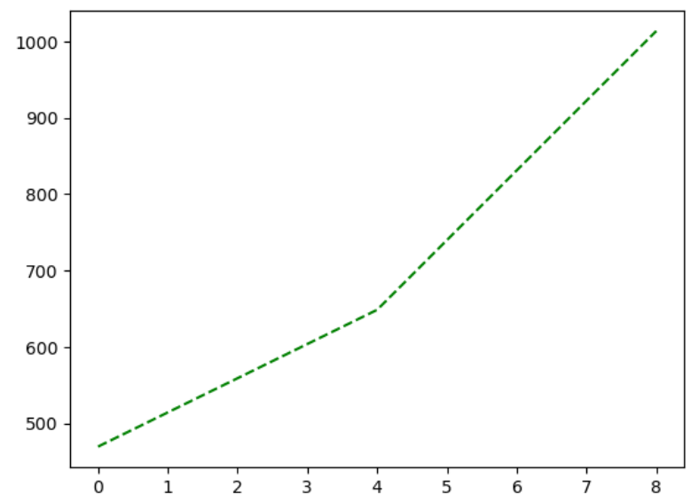
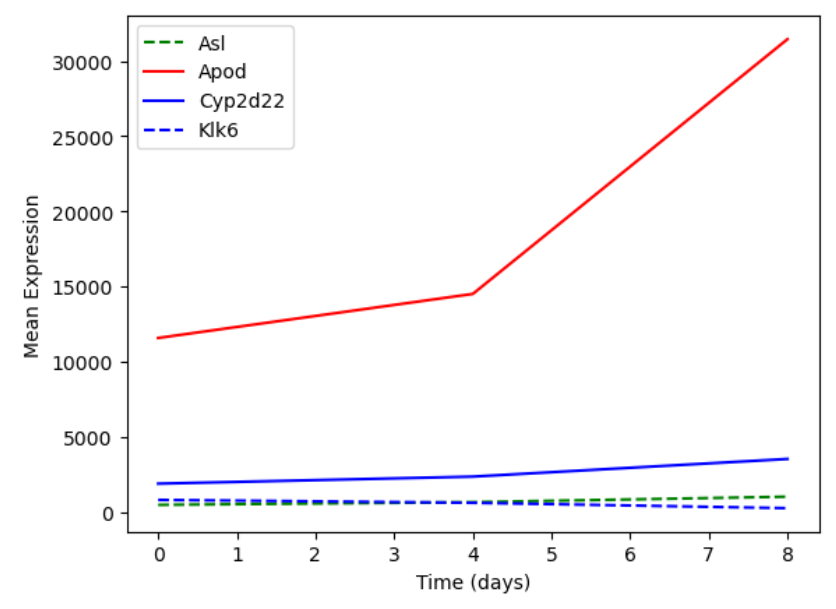
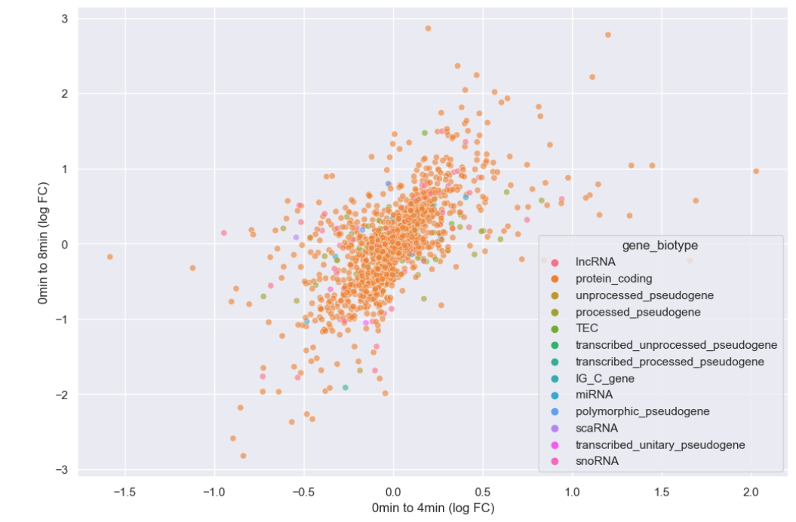
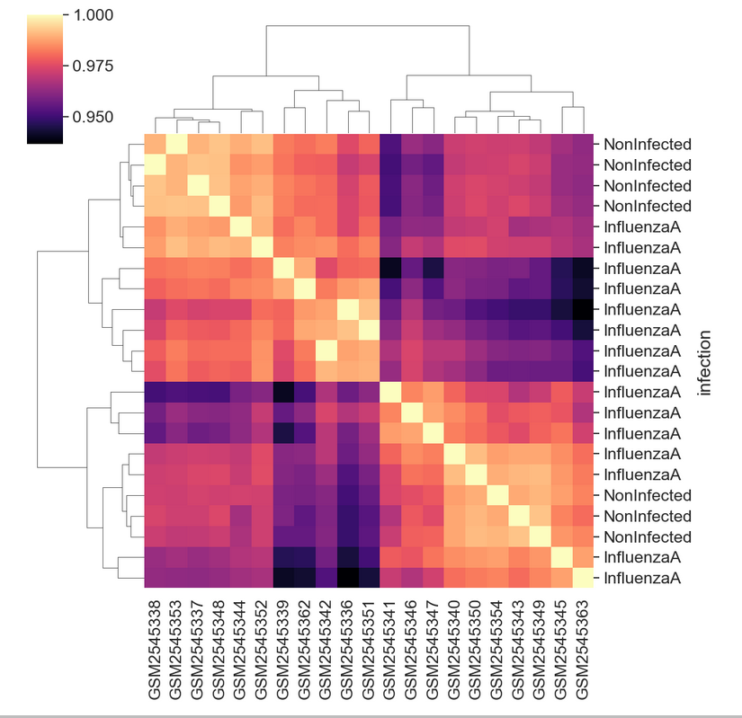
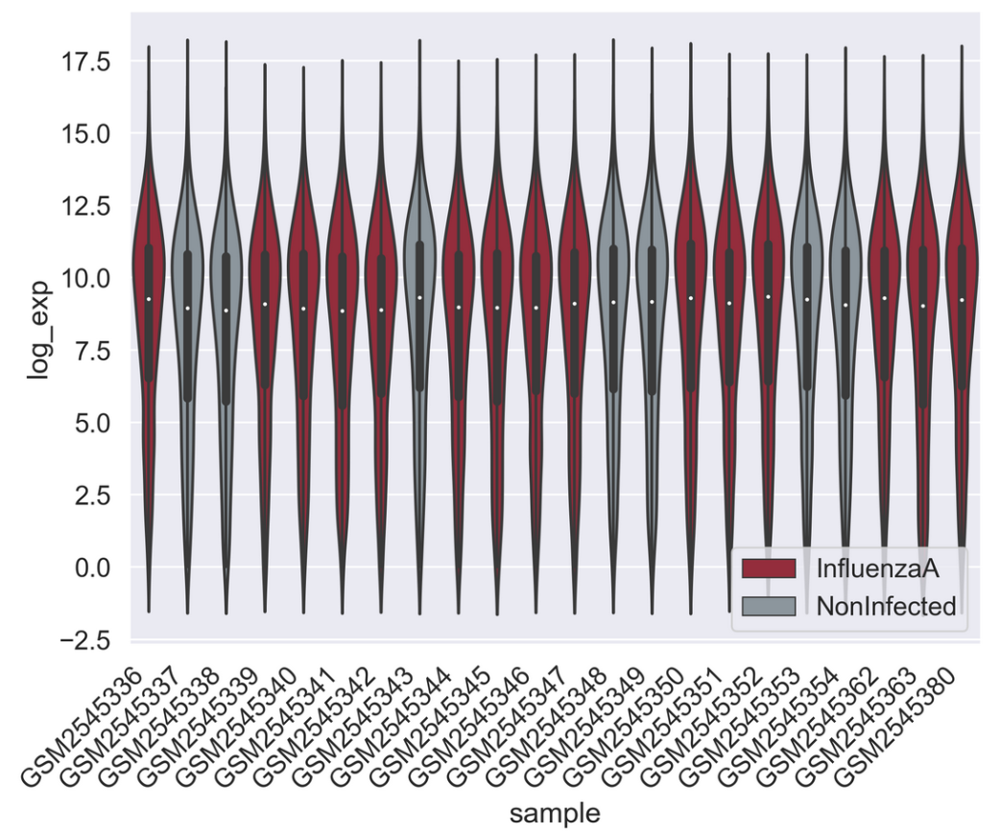
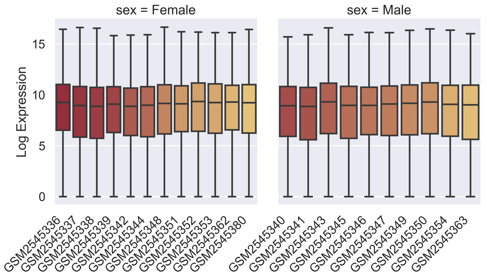

:::::::::::::::::::::::::::::::::::::: questions 

- How can I plot my data?
- How can I save my plot for publishing?

::::::::::::::::::::::::::::::::::::::::::::::::

::::::::::::::::::::::::::::::::::::: objectives

- Create a time series plot showing a single data set.
- Create a scatter plot showing relationship between two data sets.

::::::::::::::::::::::::::::::::::::::::::::::::

::::::::::::::::::::::::::::::::::::: keypoints

- [`matplotlib`](https://matplotlib.org/) is the most widely used scientific plotting library in Python.
- Plot data directly from a Pandas dataframe.
- Select and transform data, then plot it.
- Many styles of plot are available: see the [Python Graph Gallery](https://python-graph-gallery.com/matplotlib/) for more options.
- Can plot many sets of data together.

::::::::::::::::::::::::::::::::::::::::::::::::

## [`matplotlib`](https://matplotlib.org/) is the most widely used scientific plotting library in Python.

*   Commonly use a sub-library called [`matplotlib.pyplot`](https://matplotlib.org/stable/api/_as_gen/matplotlib.pyplot.html#module-matplotlib.pyplot).
*   The Jupyter Notebook will render plots inline by default.

```python
import matplotlib.pyplot as plt
```

*   Simple plots are then (fairly) simple to create.

```python
time = [0, 1, 2, 3]
position = [0, 100, 200, 300]

plt.plot(time, position)
plt.xlabel('Time (hr)')
plt.ylabel('Position (km)')
```


::: callout
## Display All Open Figures

In our Jupyter Notebook example, running the cell should generate the figure directly below the code. 
The figure is also included in the Notebook document for future viewing.
However, other Python environments like an interactive Python session started from a terminal 
or a Python script executed via the command line require an additional command to display the figure.

Instruct `matplotlib` to show a figure:

```python
plt.show()
```
This command can also be used within a Notebook - for instance, to display multiple figures
if several are created by a single cell.

:::

## Plot data directly from a [`Pandas dataframe`](https://pandas.pydata.org/pandas-docs/stable/reference/api/pandas.DataFrame.html).

*   We can also plot [Pandas dataframes](https://pandas.pydata.org/pandas-docs/stable/generated/pandas.DataFrame.html).
*   This implicitly uses [`matplotlib.pyplot`](https://matplotlib.org/stable/api/_as_gen/matplotlib.pyplot.html#module-matplotlib.pyplot).

```python
import pandas as pd

url = "https://raw.githubusercontent.com/ccb-hms/workbench-python-workshop/main/episodes/data/rnaseq.csv"
rnaseq_df = pd.read_csv(url, index_col=0)

rnaseq_df.loc[:,'expression'].plot(kind = 'hist')
```


## Select and transform data, then plot it.

*   By default, [`DataFrame.plot`](https://pandas.pydata.org/pandas-docs/stable/generated/pandas.DataFrame.plot.html#pandas.DataFrame.plot) plots with the rows as the X axis.
*   We can transform the data to plot multiple samples.

```python
expression_matrix = rnaseq_df.pivot_table(columns = "time", values = "expression", index="gene")
expression_matrix.plot(kind="box", logy=True)
```


## Many plot options are available.

*   For example, we can use the `subplots` argument to separate our plot automatically by column.

```python
expression_matrix.plot(kind="hist", subplots=True)
```


## Data can also be plotted by calling the `matplotlib` `plot` function directly.
*   The command is `plt.plot(x, y)`
*   The color and format of markers can also be specified as an additional optional argument e.g., `b-` is a blue line, `g--` is a green dashed line.

```python
expression_asl = expression_matrix.loc['Asl']
plt.plot(expression_asl, 'g--')
```



## You can plot many sets of data together.

```python
plt.plot(expression_matrix.loc['Asl'], 'g--', label = 'Asl')
plt.plot(expression_matrix.loc['Apod'], 'r-', label = 'Apod')
plt.plot(expression_matrix.loc['Cyp2d22'], 'b-', label = 'Cyp2d22')
plt.plot(expression_matrix.loc['Klk6'], 'b--', label = 'Klk6')

# Create legend.
plt.legend(loc='upper left')
plt.xlabel('Time (days)')
plt.ylabel('Mean Expression')
```



::: callout
## Adding a Legend

Often when plotting multiple datasets on the same figure it is desirable to have 
a legend describing the data.

This can be done in `matplotlib` in two stages:

* Provide a label for each dataset in the figure:

```python
plt.plot(expression_matrix.loc['Asl'], 'g--', label = 'Asl')
plt.plot(expression_matrix.loc['Apod'], 'r-', label = 'Apod')
```

* Instruct `matplotlib` to create the legend.

```python
plt.legend()
```


By default matplotlib will attempt to place the legend in a suitable position. If you
would rather specify a position this can be done with the `loc=` argument, e.g to place
the legend in the upper left corner of the plot, specify `loc='upper left'`

:::

## Seaborn provides more integrated plotting with Pandas and useful defaults

[Seaborn](https://seaborn.pydata.org/index.html) is a plotting library build ontop of `matplotlib.pyplot`.
It provides higher-level functions for creating high quality data visualizations, and easily integrates with pandas dataframes. 

Let's see what a boxplot looks like using seaborn.

```python
import seaborn as sns
import numpy as np

#Use seaborn default styling
sns.set_theme()

#Add a log expression column with a pseudocount of 1
rnaseq_df = rnaseq_df.assign(log_exp = np.log2(rnaseq_df["expression"]+1))

sns.boxplot(data = rnaseq_df, x = "time", y = "log_exp")
```


Instead of providing data to x and y directly, with seaborn we instead give it a dataframe with the `data` argument, then tell seaborn which columns of the dataframe we want to be used for each axis. 

Notice that we don't have to give reshaped data to seaborn, it aggregates our data for us. 
However, we still have to do more complicated transformations ourselves. 

## Scenario: log foldchange scatterplot

Imagine we want to compare how different genes behave at different timepoints, and we are expecially interested if genes on any chromosome or of a specific type stnad out. 
Let's make a scatterplot of the log-foldchange of our genes step-by-step. 

### Prepare the data

First, we need to aggregate our data. 
We could join `expression_matrix` with the columns we want from `rnaseq_df`, but instead let's re-pivot our data and bring `gene_biotype` and `chromosome_name` along.

```python
time_matrix = rnaseq_df.pivot_table(columns = "time", values = "log_exp", index=["gene", "chromosome_name", "gene_biotype"])
time_matrix = time_matrix.reset_index(level=["chromosome_name", "gene_biotype"])
print(time_matrix)
```

```output
time     chromosome_name    gene_biotype          0          4          8
gene                                                                     
AI504432               3          lncRNA  10.010544  10.085962   9.974814
AW046200               8          lncRNA   7.275920   7.226188   6.346325
AW551984               9  protein_coding   7.860330   7.264752   8.194396
Aamp                   1  protein_coding  12.159714  12.235069  12.198784
Abca12                 1  protein_coding   2.509810   2.336441   2.329376
...                  ...             ...        ...        ...        ...
Zkscan3               13  protein_coding  11.031923  10.946440  10.696602
Zranb1                 7  protein_coding  12.546820  12.646836  12.984985
Zranb3                 1  protein_coding   7.582472   7.611006   7.578124
Zscan22                7  protein_coding   9.239555   9.049392   8.689101
Zw10                   9  protein_coding  10.586751  10.598198  10.524456

[1474 rows x 5 columns]
```


::: challenge
## Dataframes practice

Starting with `time_matrix`, add new columns for the log foldchange from 0 to 4 hours and one with the log foldchange from 0 to 8 hours.

::: solution

We already have the mean log expression each gene at each timepoint.
We need to calculate the foldchange.


```python
# We have to use loc here since our column name is a number
time_matrix["logfc_0_4"] = time_matrix.loc[:,4] - time_matrix.loc[:,0]
time_matrix["logfc_0_8"] = time_matrix.loc[:,8] - time_matrix.loc[:,0]
print(time_matrix)
```

```output
time     chromosome_name    gene_biotype          0          4          8  \
gene                                                                        
AI504432               3          lncRNA  10.010544  10.085962   9.974814   
AW046200               8          lncRNA   7.275920   7.226188   6.346325   
AW551984               9  protein_coding   7.860330   7.264752   8.194396   
Aamp                   1  protein_coding  12.159714  12.235069  12.198784   
Abca12                 1  protein_coding   2.509810   2.336441   2.329376   
...                  ...             ...        ...        ...        ...   
Zkscan3               13  protein_coding  11.031923  10.946440  10.696602   
Zranb1                 7  protein_coding  12.546820  12.646836  12.984985   
Zranb3                 1  protein_coding   7.582472   7.611006   7.578124   
Zscan22                7  protein_coding   9.239555   9.049392   8.689101   
Zw10                   9  protein_coding  10.586751  10.598198  10.524456   

time      logfc_0_4  logfc_0_8  
gene                            
AI504432   0.075419  -0.035730  
AW046200  -0.049732  -0.929596  
AW551984  -0.595578   0.334066  
Aamp       0.075354   0.039070  
Abca12    -0.173369  -0.180433  
...             ...        ...  
Zkscan3   -0.085483  -0.335321  
Zranb1     0.100015   0.438165  
Zranb3     0.028535  -0.004348  
Zscan22   -0.190164  -0.550454  
Zw10       0.011447  -0.062295  

[1474 rows x 7 columns]
```

Note that we could have first calculate foldchange and then log transform it, but performing subtraction is more precise than division in most programming languages, so log transforming first is preferred. 

:::
:::

### Making an effective scatterplot

Now we can make a scatterplot of the foldchanges.

```python
sns.scatterplot(data = time_matrix, x = "logfc_0_4", y = "logfc_0_8")
```


Let's now improve this plot step-by-step. 
First we can give the axes more human-readable names than the dataframe's column names. 

```python
sns.scatterplot(data = time_matrix, x = "logfc_0_4", y = "logfc_0_8")
plt.xlabel("0min to 4min (log FC)")
plt.ylabel("0min to 8min (log FC)")
```


It is difficult to see see the density of genes due to there being so many points. 
Lets make the points a little transparent to help with this by changing their `alpha` level. 

```python
sns.scatterplot(data = time_matrix, x = "logfc_0_4", y = "logfc_0_8", alpha = 0.4)
plt.xlabel("0min to 4min (log FC)")
plt.ylabel("0min to 8min (log FC)")
```


Or we could make the points smaller by adjusting the `s` argument.

```python
sns.scatterplot(data = time_matrix, x = "logfc_0_4", y = "logfc_0_8", alpha = 0.6, s=4)
plt.xlabel("0min to 4min (log FC)")
plt.ylabel("0min to 8min (log FC)")
```


Now let's incorporate `gene_biotype`. 
To do this, we can set the `hue` of the scatterplot to the column name. 
We're also going to make some more room for the plot by changing matplotlib's `rcParams`, which are the global plotting settings. 

::: callout
## Global plot settings with `rcParams`

`rcParams` is a specialized dictionary used by `matplotlib` to store all global plot settings. 
You can change `rcParams` to set things like the

:::


```python
plt.rcParams['figure.figsize'] = [12, 8]
sns.scatterplot(data = time_matrix, x = "logfc_0_4", y = "logfc_0_8", alpha = 0.6, hue="gene_biotype")
plt.xlabel("0min to 4min (log FC)")
plt.ylabel("0min to 8min (log FC)")
```



It looks like we overwhelmingly have protein coding genes in the dataset. 
Instead of plotting every biotype, let's just plot whether or not the genes are protein coding. 

::: challenge

Create a new boolean column, `is_protein_coding` which specifies whether or not each gene is protein coding. 

Make a scatterplot where the `style` of the points varies with `is_protein_coding`. 

::: solution

```python
time_matrix["is_protein_coding"] = time_matrix["gene_biotype"]=="protein_coding"
print(time_matrix)
```

```output
time     chromosome_name    gene_biotype          0          4          8  \
gene                                                                        
AI504432               3          lncRNA  10.010544  10.085962   9.974814   
AW046200               8          lncRNA   7.275920   7.226188   6.346325   
AW551984               9  protein_coding   7.860330   7.264752   8.194396   
Aamp                   1  protein_coding  12.159714  12.235069  12.198784   
Abca12                 1  protein_coding   2.509810   2.336441   2.329376   
...                  ...             ...        ...        ...        ...   
Zkscan3               13  protein_coding  11.031923  10.946440  10.696602   
Zranb1                 7  protein_coding  12.546820  12.646836  12.984985   
Zranb3                 1  protein_coding   7.582472   7.611006   7.578124   
Zscan22                7  protein_coding   9.239555   9.049392   8.689101   
Zw10                   9  protein_coding  10.586751  10.598198  10.524456   

time      logfc_0_4  logfc_0_8  is_protein_coding  
gene                                               
AI504432   0.075419  -0.035730              False  
AW046200  -0.049732  -0.929596              False  
AW551984  -0.595578   0.334066               True  
Aamp       0.075354   0.039070               True  
Abca12    -0.173369  -0.180433               True  
...             ...        ...                ...  
Zkscan3   -0.085483  -0.335321               True  
Zranb1     0.100015   0.438165               True  
Zranb3     0.028535  -0.004348               True  
Zscan22   -0.190164  -0.550454               True  
Zw10       0.011447  -0.062295               True  

[1474 rows x 8 columns]
```

```python
sns.scatterplot(data = time_matrix, x = "logfc_0_4", y = "logfc_0_8", alpha = 0.6, style="is_protein_coding")
plt.xlabel("0min to 4min (log FC)")
plt.ylabel("0min to 8min (log FC)")
```


:::
:::

Now that hue is freed up, we can use it to encode for chromosome. 

```python
#This hit my personal stylistic limit, so I'm spread the call to multiple lines
sns.scatterplot(data = time_matrix, 
                x = "logfc_0_4", 
                y = "logfc_0_8", 
                alpha = 0.6, 
                style = "is_protein_coding",
                hue = "chromosome_name")
plt.xlabel("0min to 4min (log FC)")
plt.ylabel("0min to 8min (log FC)")
```


There doesn't seem to be any interesting pattern.
Let's go back to just plotting whether or not the gene is protein coding, and do a little more to clean up the plot.

```python
# This scales all text in the plot by 150%
sns.set(font_scale = 1.5)

sns.scatterplot(data = time_matrix, 
                x = "logfc_0_4", 
                y = "logfc_0_8", 
                alpha = 0.6, 
                hue = "is_protein_coding", 
                #Sets the color pallete to map values to
                palette = "mako")
plt.xlabel("0min to 4min (log FC)")
plt.ylabel("0min to 8min (log FC)")

# Set a legend title and give it 2 columns
plt.legend(ncol = 2, title="Is Protein Coding")
```


## Heatmaps

Seaborn also has great built-in support for heatmaps. 

We can make heatmaps using `heatmap` or `clustermap`, depending on if we want our data to be clustered. 
Let's take a look at the correlation matrix for our samples.

```python
sample_matrix = rnaseq_df.pivot_table(columns = "sample", values = "log_exp", index="gene")
print(sample_matrix.corr())
```

```output
sample      GSM2545336  GSM2545337  GSM2545338  GSM2545339  GSM2545340  \
sample                                                                   
GSM2545336    1.000000    0.972832    0.970700    0.979381    0.957032   
GSM2545337    0.972832    1.000000    0.992230    0.983430    0.972068   
GSM2545338    0.970700    0.992230    1.000000    0.981653    0.970098   
GSM2545339    0.979381    0.983430    0.981653    1.000000    0.961275   
GSM2545340    0.957032    0.972068    0.970098    0.961275    1.000000   
GSM2545341    0.957018    0.951554    0.950648    0.940430    0.979411   
GSM2545342    0.987712    0.980026    0.978246    0.974903    0.968918   
GSM2545343    0.948861    0.971826    0.973301    0.959663    0.988114   
GSM2545344    0.973664    0.987626    0.985568    0.980757    0.970084   
GSM2545345    0.943748    0.963804    0.963715    0.946226    0.984994   
GSM2545346    0.967839    0.961595    0.957958    0.955665    0.984706   
GSM2545347    0.958351    0.957363    0.955393    0.944399    0.982981   
GSM2545348    0.973558    0.992018    0.991673    0.982984    0.971515   
GSM2545349    0.948938    0.970211    0.971276    0.955778    0.988263   
GSM2545350    0.952803    0.973764    0.971737    0.960796    0.991229   
GSM2545351    0.991921    0.977846    0.973363    0.979936    0.962843   
GSM2545352    0.980437    0.989274    0.986909    0.983319    0.974796   
GSM2545353    0.974628    0.989940    0.989857    0.982648    0.971325   
GSM2545354    0.950621    0.972800    0.972051    0.959123    0.987231   
GSM2545362    0.986494    0.981655    0.978767    0.988969    0.962088   
GSM2545363    0.936577    0.962115    0.962892    0.940839    0.980774   
GSM2545380    0.988869    0.977962    0.975382    0.973683    0.965520   

sample      GSM2545341  GSM2545342  GSM2545343  GSM2545344  GSM2545345  ...  \
sample                                                                  ...   
GSM2545336    0.957018    0.987712    0.948861    0.973664    0.943748  ...   
GSM2545337    0.951554    0.980026    0.971826    0.987626    0.963804  ...   
GSM2545338    0.950648    0.978246    0.973301    0.985568    0.963715  ...   
GSM2545339    0.940430    0.974903    0.959663    0.980757    0.946226  ...   
GSM2545340    0.979411    0.968918    0.988114    0.970084    0.984994  ...   
GSM2545341    1.000000    0.967231    0.967720    0.958880    0.978091  ...   
GSM2545342    0.967231    1.000000    0.959923    0.980462    0.957994  ...   
GSM2545343    0.967720    0.959923    1.000000    0.965428    0.983462  ...   
GSM2545344    0.958880    0.980462    0.965428    1.000000    0.967708  ...   
GSM2545345    0.978091    0.957994    0.983462    0.967708    1.000000  ...   
GSM2545346    0.983828    0.973720    0.977478    0.962581    0.976912  ...   
GSM2545347    0.986949    0.968972    0.974794    0.962113    0.981518  ...   
GSM2545348    0.950961    0.980532    0.974156    0.986710    0.965095  ...   
GSM2545349    0.971058    0.960674    0.992085    0.966662    0.986116  ...   
GSM2545350    0.973947    0.964523    0.990495    0.970990    0.986146  ...   
GSM2545351    0.961638    0.989280    0.953650    0.979976    0.950451  ...   
GSM2545352    0.960888    0.985541    0.971954    0.990066    0.968691  ...   
GSM2545353    0.952424    0.982904    0.971896    0.989196    0.965436  ...   
GSM2545354    0.973524    0.961077    0.988615    0.972600    0.987209  ...   
GSM2545362    0.951186    0.982616    0.955145    0.983885    0.946956  ...   
GSM2545363    0.970944    0.952557    0.980218    0.965252    0.987553  ...   
GSM2545380    0.963521    0.990511    0.957152    0.978371    0.956813  ...   

sample      GSM2545348  GSM2545349  GSM2545350  GSM2545351  GSM2545352  \
sample                                                                   
GSM2545336    0.973558    0.948938    0.952803    0.991921    0.980437   
GSM2545337    0.992018    0.970211    0.973764    0.977846    0.989274   
GSM2545338    0.991673    0.971276    0.971737    0.973363    0.986909   
GSM2545339    0.982984    0.955778    0.960796    0.979936    0.983319   
GSM2545340    0.971515    0.988263    0.991229    0.962843    0.974796   
GSM2545341    0.950961    0.971058    0.973947    0.961638    0.960888   
GSM2545342    0.980532    0.960674    0.964523    0.989280    0.985541   
GSM2545343    0.974156    0.992085    0.990495    0.953650    0.971954   
GSM2545344    0.986710    0.966662    0.970990    0.979976    0.990066   
GSM2545345    0.965095    0.986116    0.986146    0.950451    0.968691   
GSM2545346    0.960875    0.978673    0.981337    0.971079    0.970621   
GSM2545347    0.958524    0.978974    0.980361    0.964883    0.967565   
GSM2545348    1.000000    0.971489    0.973997    0.977225    0.990905   
GSM2545349    0.971489    1.000000    0.990858    0.954456    0.971922   
GSM2545350    0.973997    0.990858    1.000000    0.959045    0.975085   
GSM2545351    0.977225    0.954456    0.959045    1.000000    0.983727   
GSM2545352    0.990905    0.971922    0.975085    0.983727    1.000000   
GSM2545353    0.992297    0.969924    0.972310    0.979291    0.991556   
GSM2545354    0.972151    0.990242    0.989228    0.956395    0.972436   
GSM2545362    0.980224    0.955712    0.959541    0.988591    0.984683   
GSM2545363    0.963226    0.983872    0.982521    0.943499    0.966163   
GSM2545380    0.979398    0.956662    0.961779    0.989683    0.985750   

sample      GSM2545353  GSM2545354  GSM2545362  GSM2545363  GSM2545380  
sample                                                                  
GSM2545336    0.974628    0.950621    0.986494    0.936577    0.988869  
GSM2545337    0.989940    0.972800    0.981655    0.962115    0.977962  
GSM2545338    0.989857    0.972051    0.978767    0.962892    0.975382  
GSM2545339    0.982648    0.959123    0.988969    0.940839    0.973683  
GSM2545340    0.971325    0.987231    0.962088    0.980774    0.965520  
GSM2545341    0.952424    0.973524    0.951186    0.970944    0.963521  
GSM2545342    0.982904    0.961077    0.982616    0.952557    0.990511  
GSM2545343    0.971896    0.988615    0.955145    0.980218    0.957152  
GSM2545344    0.989196    0.972600    0.983885    0.965252    0.978371  
GSM2545345    0.965436    0.987209    0.946956    0.987553    0.956813  
GSM2545346    0.963956    0.975386    0.961966    0.967480    0.973104  
GSM2545347    0.961118    0.977208    0.952988    0.972364    0.967319  
GSM2545348    0.992297    0.972151    0.980224    0.963226    0.979398  
GSM2545349    0.969924    0.990242    0.955712    0.983872    0.956662  
GSM2545350    0.972310    0.989228    0.959541    0.982521    0.961779  
GSM2545351    0.979291    0.956395    0.988591    0.943499    0.989683  
GSM2545352    0.991556    0.972436    0.984683    0.966163    0.985750  
GSM2545353    1.000000    0.971512    0.980850    0.962497    0.981468  
GSM2545354    0.971512    1.000000    0.958851    0.983429    0.957011  
GSM2545362    0.980850    0.958851    1.000000    0.942461    0.980664  
GSM2545363    0.962497    0.983429    0.942461    1.000000    0.951069  
GSM2545380    0.981468    0.957011    0.980664    0.951069    1.000000  

[22 rows x 22 columns]
```

We can see the structure of these correlations in a clustered heatmap.

```python
sns.clustermap(sample_matrix.corr())
```


We can change the color mapping.

```python
sns.clustermap(sample_matrix.corr(), cmap = "magma")
```


We can add sample information to the plot by changing the index.
First we need to get the data.

```python
# We select all of the columns related to the samples we might want to look at, group by sample, then aggregate by the most common value, or mode
sample_data = rnaseq_df[['sample','organism', 'age', 'sex', 'infection',
       'strain', 'time', 'tissue', 'mouse']].groupby('sample').agg(pd.Series.mode)
print(sample_data)
```

```output
	organism 	age 	sex 	infection 	strain 	time 	tissue 	mouse
sample 								
GSM2545336 	Mus musculus 	8 	Female 	InfluenzaA 	C57BL/6 	8 	Cerebellum 	14
GSM2545337 	Mus musculus 	8 	Female 	NonInfected 	C57BL/6 	0 	Cerebellum 	9
GSM2545338 	Mus musculus 	8 	Female 	NonInfected 	C57BL/6 	0 	Cerebellum 	10
GSM2545339 	Mus musculus 	8 	Female 	InfluenzaA 	C57BL/6 	4 	Cerebellum 	15
GSM2545340 	Mus musculus 	8 	Male 	InfluenzaA 	C57BL/6 	4 	Cerebellum 	18
GSM2545341 	Mus musculus 	8 	Male 	InfluenzaA 	C57BL/6 	8 	Cerebellum 	6
GSM2545342 	Mus musculus 	8 	Female 	InfluenzaA 	C57BL/6 	8 	Cerebellum 	5
GSM2545343 	Mus musculus 	8 	Male 	NonInfected 	C57BL/6 	0 	Cerebellum 	11
GSM2545344 	Mus musculus 	8 	Female 	InfluenzaA 	C57BL/6 	4 	Cerebellum 	22
GSM2545345 	Mus musculus 	8 	Male 	InfluenzaA 	C57BL/6 	4 	Cerebellum 	13
GSM2545346 	Mus musculus 	8 	Male 	InfluenzaA 	C57BL/6 	8 	Cerebellum 	23
GSM2545347 	Mus musculus 	8 	Male 	InfluenzaA 	C57BL/6 	8 	Cerebellum 	24
GSM2545348 	Mus musculus 	8 	Female 	NonInfected 	C57BL/6 	0 	Cerebellum 	8
GSM2545349 	Mus musculus 	8 	Male 	NonInfected 	C57BL/6 	0 	Cerebellum 	7
GSM2545350 	Mus musculus 	8 	Male 	InfluenzaA 	C57BL/6 	4 	Cerebellum 	1
GSM2545351 	Mus musculus 	8 	Female 	InfluenzaA 	C57BL/6 	8 	Cerebellum 	16
GSM2545352 	Mus musculus 	8 	Female 	InfluenzaA 	C57BL/6 	4 	Cerebellum 	21
GSM2545353 	Mus musculus 	8 	Female 	NonInfected 	C57BL/6 	0 	Cerebellum 	4
GSM2545354 	Mus musculus 	8 	Male 	NonInfected 	C57BL/6 	0 	Cerebellum 	2
GSM2545362 	Mus musculus 	8 	Female 	InfluenzaA 	C57BL/6 	4 	Cerebellum 	20
GSM2545363 	Mus musculus 	8 	Male 	InfluenzaA 	C57BL/6 	4 	Cerebellum 	12
GSM2545380 	Mus musculus 	8 	Female 	InfluenzaA 	C57BL/6 	8 	Cerebellum 	19
```

Then we can join, set the index, and plot to see the sample groupings. 

```python
corr_df = sample_matrix.corr()
corr_df = corr_df.join(sample_data)
corr_df = corr_df.set_index("infection")
sns.clustermap(corr_df.iloc[:,:-8],
               cmap = "magma")
```



::: challenge
## Creating a boxplot

Visualize log mean gene expression by sample and some other variable of choice in `rnaseq_df`.
Take some time to try to get this plot close to publication ready for either a poster, presentation, or paper. 

::: hint

You may need want to rotate the x labels of the plot, which can be done with `plt.xticks(rotation = degrees)` where `degrees` is the number of degrees you wish to rotate by. 

:::

::: hint

Check out some of the details of `sns.set_context()` [here](https://seaborn.pydata.org/tutorial/aesthetics.html#scaling-plot-elements).
Seaborn has useful size default for different figure types. 

:::

::: solution

Your plot will of course vary, but here are some examples of what we can do:

```python
sns.set_context("talk")
# Things like this will depend on your screen resolution and size
#plt.rcParams['figure.figsize'] = [8, 6]
#plt.rcParams['figure.dpi'] = 300
#sns.set(font_scale=1.25)
sns.set_palette(sns.color_palette("rocket_r", n_colors=3))
sns.boxplot(rnaseq_df, 
            x = "sample", 
            y = "log_exp",
            hue = "time", 
            dodge=False)
plt.xticks(rotation=45, ha='right');
plt.ylabel("Log Expression")
plt.xlabel("")
# See this thread for more discussion of legend positions: https://stackoverflow.com/a/43439132
plt.legend(title='Days Post Infection', loc=(1.04, 0.5), labels=['0 days','4 days','8 days'])
```


```python
sns.set_palette(["#A51C30","#8996A0"])
sns.violinplot(rnaseq_df, 
            x = "sample", 
            y = "log_exp",
            hue = "infection", 
            dodge=False)
plt.xticks(rotation=45, ha='right');
plt.legend(loc = 'lower right')
```



```python
sns.set_context("talk")
pal = sns.color_palette("blend:#A51C30,#FFDB6D", 24)
g = sns.catplot(rnaseq_df,
            kind = "box",
            x = "sample", 
            y = "log_exp",
            col = "sex",
            dodge=False, 
            hue = "sample",
            palette = pal,
            sharex = False)
for axes in g.axes.flat:
    _ = axes.set_xticklabels(axes.get_xticklabels(), rotation=45, ha='right')
g.set_axis_labels("", "Log Expression")
plt.subplots_adjust(wspace=0.1)
```



:::

:::

::: callout
## Saving your plot to a file

If you are satisfied with the plot you see you may want to save it to a file,
perhaps to include it in a publication. There is a function in the
matplotlib.pyplot module that accomplishes this:
[savefig](https://matplotlib.org/api/_as_gen/matplotlib.pyplot.savefig.html).
Calling this function, e.g. with

```python
plt.savefig('my_figure.png')
```

will save the current figure to the file `my_figure.png`. The file format
will automatically be deduced from the file name extension (other formats
are pdf, ps, eps and svg).

Note that functions in `plt` refer to a global figure variable
and after a figure has been displayed to the screen (e.g. with `plt.show`) 
matplotlib will make this  variable refer to a new empty figure.
Therefore, make sure you call `plt.savefig` before the plot is displayed to
the screen, otherwise you may find a file with an empty plot.

When using dataframes, data is often generated and plotted to screen in one line.
In addition to using `plt.savefig`, we can save a reference to the current figure 
in a local variable (with `plt.gcf`) and call the `savefig` class method from 
that variable to save the figure to file.

```python
data.plot(kind='bar')
fig = plt.gcf() # get current figure
fig.savefig('my_figure.png')
```


This supports most common image formats such as `png`, `svg`, `pdf`, etc.

:::

::: callout
## Making your plots accessible

Whenever you are generating plots to go into a paper or a presentation, there are a few things you can do to make sure that everyone can understand your plots.
* Always make sure your text is large enough to read. Use the `fontsize` parameter in `xlabel`, `ylabel`, `title`, and `legend`, and [`tick_params` with `labelsize`](https://matplotlib.org/2.1.1/api/_as_gen/matplotlib.pyplot.tick_params.html) to increase the text size of the numbers on your axes.
* Similarly, you should make your graph elements easy to see. Use `s` to increase the size of your scatterplot markers and `linewidth` to increase the sizes of your plot lines.
* Using color (and nothing else) to distinguish between different plot elements will make your plots unreadable to anyone who is colorblind, or who happens to have a black-and-white office printer. For lines, the `linestyle` parameter lets you use different types of lines. For scatterplots, `marker` lets you change the shape of your points. If you're unsure about your colors, you can use [Coblis](https://www.color-blindness.com/coblis-color-blindness-simulator/) or [Color Oracle](https://colororacle.org/) to simulate what your plots would look like to those with colorblindness.
:::
