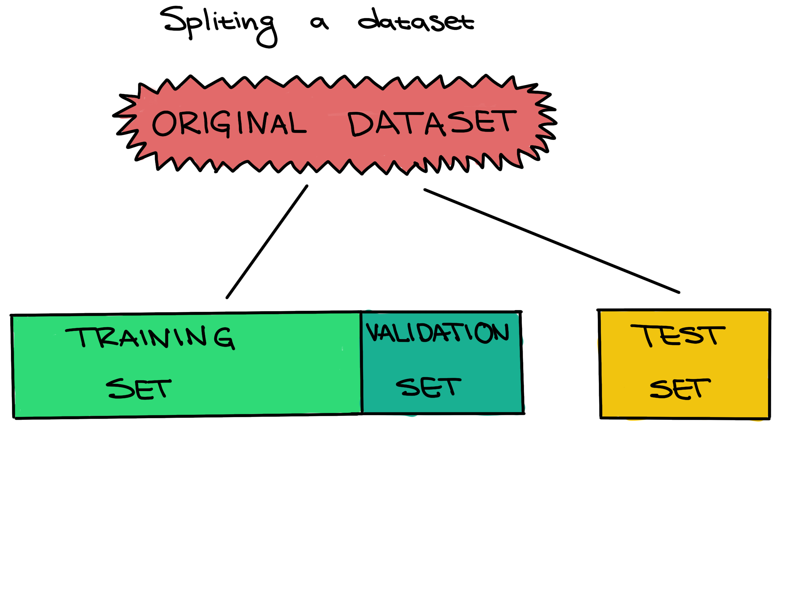

:::::::::::::::::::::::::::::::::::::: questions 

- What is Scikit-learn
- How is Scikit-learn used for a typical machine learning workflow?

::::::::::::::::::::::::::::::::::::::::::::::::

::::::::::::::::::::::::::::::::::::: objectives

- Explore the `sklearn` library.
- Walk through a typical machine learning workflow in Scikit-learn. 
- Examine machine learning evaluation plots.

::::::::::::::::::::::::::::::::::::::::::::::::

::::::::::::::::::::::::::::::::::::: keypoints

- Scikit-learn is a popular package for machine learning in Python. 
- Scikit-learn has a variety of useful functionality for creating predictive models. 
- A machine learning workflow involves preprocessing, model selection, training, and evaluation. 

::::::::::::::::::::::::::::::::::::::::::::::::


## Scikit-learn is a popular package for machine learning in Python. 

[Scikit-learn](https://scikit-learn.org/stable/) (also called `sklearn`) is a popular machine learning package in Python.
It has a wide variety of functionality which aid in creating, training, and evaluating machine learning models.

Some of its functionality includes:

- Classification: predicting a category such as active/inactive or what animal a picture is of. 
- Regression: predicting a quantity such as temperature, survival time, or age.  
- Clustering: determining groupings such as trying to create groups based on the structure of the data, such as disease subtypes or celltypes. 
- Dimentionality reduction: projecting data from a high-dimensional to a low-dimensional space for visualization and exploration. PCA, UMAP, and TSNE are all dimensionality reduction methods. 
- Model selection: choosing which model to use. This module includes methods for splitting data for training, evaluation metrics, hyperparameter optimization, and more.
- Preprocessing: cleaning and transforming data for machine learning. This includes imputing missing data, normalization, denoising, and extracting features (for instance, creating a "season" feature from dates, or creating a "brightness" feature from an image). 

Let's import the modules and other packages we need. 

``` python
import pandas as pd
from sklearn import model_selection, ensemble, metrics
import numpy as np
from matplotlib import pyplot as plt
import seaborn as sns
sns.set_theme(style='ticks')
```

## Data description

The data we will be using for this lesson comes from [Lee et al, 2018](https://academic.oup.com/nar/article/46/10/4903/4990019?login=false).
In order to achieve replicative immortality, human cancer cells need to activate a telomere maintenance mechanism (TMM). 
Cancer cells typically use either the enzyme telomerase, or the Alternative Lengthening of Telomeres (ALT) pathway. 
The machine learning task we will be exporing is to create a model which can use a cancer cell's telomere repeat composition to predict whether or not a tumor cell is using the ALT pathway.

More formally, we are predicting a *binary variable* for each sample, whether the TMM is using the ALT pathway (positive) or not (negative). 
In machine learning we refer to this as the **target variable** or **class** of the data.
We have set of columns in the dataset which indicate the six-mer composition of the sample's telomeres by percent. 

```python
# Load data
data = pd.read_csv("https://raw.githubusercontent.com/HMS-Data-Club/python-environments/main/data/telomere_ALT/telomere.csv", sep='\t')
num_row = data.shape[0]     # number of samples in the dataset
num_col = data.shape[1]     # number of features in the dataset (plus the label column)
print(data)
```

```output
     TTAGGG  ATAGGG  CTAGGG  GTAGGG  TAAGGG  TCAGGG  TGAGGG  TTCGGG  TTGGGG  \
0    94.846   0.019   0.430   0.422   0.216   0.544   1.762   0.535   0.338   
1    94.951   0.011   0.241   0.491   0.223   0.317   1.351   0.818   0.702   
2    94.889   0.043   0.439   0.478   0.355   0.316   1.151   0.625   0.313   
3    94.202   0.017   0.252   0.509   0.396   0.548   1.877   0.856   0.440   
4    96.368   0.011   0.078   0.131   0.015   0.306   1.525   1.165   0.126   
..      ...     ...     ...     ...     ...     ...     ...     ...     ...   
156  98.608   0.001   0.100   0.219   0.000   0.196   0.421   0.101   0.229   
157  98.176   0.000   0.145   0.304   0.088   0.158   0.446   0.181   0.292   
158  99.393   0.000   0.017   0.155   0.000   0.030   0.190   0.065   0.073   
159  98.742   0.003   0.077   0.169   0.002   0.091   0.304   0.211   0.206   
160  98.738   0.009   0.138   0.113   0.000   0.371   0.186   0.080   0.163   

     TTTGGG  ...  TTACGG  TTATGG  TTAGAG  TTAGCG  TTAGTG  TTAGGA  TTAGGC  \
0     0.068  ...   0.028   0.118   0.153   0.000   0.049   0.060   0.033   
1     0.090  ...   0.024   0.125   0.080   0.024   0.035   0.155   0.030   
2     0.079  ...   0.041   0.253   0.195   0.032   0.043   0.161   0.047   
3     0.097  ...   0.053   0.110   0.125   0.000   0.043   0.069   0.029   
4     0.000  ...   0.014   0.099   0.022   0.000   0.019   0.026   0.009   
..      ...  ...     ...     ...     ...     ...     ...     ...     ...   
156   0.000  ...   0.019   0.020   0.016   0.000   0.004   0.025   0.011   
157   0.023  ...   0.012   0.013   0.043   0.000   0.005   0.009   0.015   
158   0.000  ...   0.008   0.014   0.009   0.000   0.003   0.012   0.013   
159   0.000  ...   0.011   0.053   0.047   0.000   0.004   0.019   0.014   
160   0.000  ...   0.015   0.049   0.023   0.000   0.021   0.037   0.021   

     TTAGGT  rel_TL  TMM  
0     0.089   -0.89    -  
1     0.093   -0.39    -  
2     0.185   -1.66    -  
3     0.110   -1.73    -  
4     0.014    0.21    -  
..      ...     ...  ...  
156   0.001    2.00    +  
157   0.013    0.98    +  
158   0.003    1.29    +  
159   0.007    1.24    +  
160   0.009    1.71    +  

[161 rows x 21 columns]
```

## Machine learning workflows involves preprocessing, model selection, training, and evaluation. 

Before we can use a model to predict ALT pathway activity, however, we have to do three steps:
1. __Preprocessing__: Gather data and get it ready for use in the machine learning model.
2. __Learning/Training__: Choose a machine learning model and train it on the data. 
3. __Evaluation__: Measure how well the model performed. Can we trust the predictions of the trained model?


In this case, our data is already preprocessed. 
In order to perform **training**, we need to split our data into a **training set** and a **testing set**.

.

Scikit-learn has useful built-in functions for splitting data inside of its `model_selection` module. 
Here, we use `train_test_split`.
The convention in Scikit-learn (as well as more generally in machine learning) is to call our feactures `X` and our target variable `y`.

```python
X = data.iloc[:, 0: num_col-1]    # feature columns
y = data['TMM']                   # label column
X_train, X_test, y_train, y_test = \
    model_selection.train_test_split(X, y, 
                                     test_size=0.2,      # reserve 20 percent data for testing
                                     stratify=y,         # stratified sampling
                                     random_state=0) # random seed
```

Setting a test set aside from the training and validation sets from the beginning, and only using it once for a final evaluation, is very important to be able to properly evaluate how well a machine learning algorithm learned. If this **data leakage** occurs it contaminates the evaluation, making the evaluation not accurately reflect how well the model actually performs. Letting the machine learning method learn from the test set can be seen as giving a student the answers to an exam; once a student sees any exam answers, their exam score will no longer reflect their true understanding of the material.

In other words, improper data splitting and data leakage means that *we will not know if our model works or not*.

Now that we have our data split up, we can select and train our model, in machine learning tasks like this also called our **classifier**.
We want to further split our training data into a traiing set and validation set so that we can freely explore different models before making our final choice. 


However, in this case we are simply going to go with a **random forest classifier**. 
[Random forests](https://scikit-learn.org/stable/modules/generated/sklearn.ensemble.RandomForestClassifier.html) are a fast classifier which tends to perform well, and is often reccomended as a first classifier to try. 

::: callout
## Definitions

Training set - The training set is a part of the original dataset that trains or fits the model. This is the data that the model uses to learn patterns and set the model parameters.

Validation set - Part of the training set is used to validate that the fitted model works on new data. This is not the final evaluation of the model. This step is used to change hyperparameters and then train the model again.

Test set - The test set checks how well we expect the model to work on new data in the future. The test set is used in the final phase of the workflow, and it evaluates the final model. It can only be used one time, and the model cannot be adjusted after using it.

Parameters - These are the aspects of a machine learning model that are learned from the training data. The parameters define the prediction rules of the trained model.

Hyperparameters - These are the user-specified settings of a machine learning model. Each machine learning method has different hyperparameters, and they control various trade-offs which change how the model learns. Hyperparameters control parts of a machine learning method such as how much emphasis the method should place on being perfectly correct versus becoming overly complex, how fast the method should learn, the type of mathematical model the method should use for learning, and more. 
:::

### Model Creation

```python
rf = ensemble.RandomForestClassifier(
    n_estimators = 10,           # 10 random trees in the forest
    criterion = 'entropy',       # use entropy as the measure of uncertainty
    max_depth = 3,               # maximum depth of each tree is 3
    min_samples_split = 5,       # generate a split only when there are at least 5 samples at current node
    class_weight = 'balanced',   # class weight is inversely proportional to class frequencies
    random_state = 0)
```

Each model in Scikit-learn has a wide variety of possible **hyperparameters** to choose from. 
These can be thought of as the settings, or knobs and dials, of the model. 

Once we've created the model, in Scikit-learn we train it using the `fit` method on the training data. 
We can then look at its score on the testing data using the `score` method. 

### Training

```python
# Refit the classifier using the full training set
rf = rf.fit(X_train, y_train)

# Compute classifier's accuracy on the test set
test_accuracy = rf.score(X_test, y_test)
print(f'Test accuracy: {test_accuracy: 0.3f}')
```

```output
Test accuracy: 0.848
```

### Evaluation

This means that we predicted the TMM correctly in about 85% of our test samples. 
As oppsed to the score, we can also directly get each of the model's predictions. 
We can either use `predict` to get a single prediction or `predict_proba` to get a probablistic confidence score. 

```python
# Predict labels for the test set
y = rf.predict(X_test)             # Solid prediction
y_prob = rf.predict_proba(X_test)  # Soft prediction
print(y)
print(y_prob)
```

```output
['+' '+' '+' '-' '-' '+' '+' '-' '-' '-' '+' '-' '+' '-' '-' '+' '-' '-'
 '-' '-' '+' '-' '-' '+' '-' '-' '-' '-' '-' '-' '+' '+' '+']
[[0.81355661 0.18644339]
 [0.85375    0.14625   ]
 [0.72272654 0.27727346]
 [0.03321429 0.96678571]
 [0.04132653 0.95867347]
 [0.98434442 0.01565558]
 [0.99230769 0.00769231]
 [0.09321429 0.90678571]
 [0.0225     0.9775    ]
 [0.08788497 0.91211503]
 [0.99238014 0.00761986]
 [0.         1.        ]
 [0.87857143 0.12142857]
 [0.0225     0.9775    ]
 [0.1        0.9       ]
 [0.52973416 0.47026584]
 [0.17481069 0.82518931]
 [0.29859926 0.70140074]
 [0.43977573 0.56022427]
 [0.         1.        ]
 [0.80117647 0.19882353]
 [0.03061224 0.96938776]
 [0.22071729 0.77928271]
 [0.72899028 0.27100972]
 [0.0975     0.9025    ]
 [0.         1.        ]
 [0.03061224 0.96938776]
 [0.         1.        ]
 [0.45651511 0.54348489]
 [0.1        0.9       ]
 [0.81355661 0.18644339]
 [0.85375    0.14625   ]
 [0.88516484 0.11483516]]
```

Instead of simple metrics such as accuracy which can be misleading, we can also look at and plot more complex metrics such as the receiver operating characteristic (ROC) curve or the precision recall (PR) curve. 

```python
# Compute the ROC and PR curves for the test set
fpr, tpr, _ = metrics.roc_curve(y_test, y_prob[:, 0], pos_label='+')
precision_plus, recall_plus, _ = metrics.precision_recall_curve(y_test, y_prob[:, 0], pos_label='+')
precision_minus, recall_minus, _ = metrics.precision_recall_curve(y_test, y_prob[:, 1], pos_label='-')

# Compute the AUROC and AUPRCs for the test set
auroc = metrics.auc(fpr, tpr)
auprc_plus = metrics.auc(recall_plus, precision_plus)
auprc_minus = metrics.auc(recall_minus, precision_minus)

# Plot the ROC curve for the test set
plt.plot(fpr, tpr, label='test (area = %.3f)' % auroc)
plt.plot([0,1], [0,1], linestyle='--', color=(0.6, 0.6, 0.6))
plt.plot([0,0,1], [0,1,1], linestyle='--', color=(0.6, 0.6, 0.6))

plt.xlim([-0.05, 1.05])
plt.ylim([-0.05, 1.05])
plt.xlabel('FPR')
plt.ylabel('TPR')
plt.legend(loc='lower right')
plt.title('ROC curve')
plt.show()

# Plot the PR curve for the test set
plt.plot(recall_plus, precision_plus, label='positive class (area = %.3f)' % auprc_plus)
plt.plot(recall_minus, precision_minus, label='negative class (area = %.3f)' % auprc_minus)
plt.plot([0,1,1], [1,1,0], linestyle='--', color=(0.6, 0.6, 0.6))
plt.xlim([-0.05, 1.05])
plt.ylim([-0.05, 1.05])
plt.xlabel('recall')
plt.ylabel('precision')
plt.legend(loc='lower left')
plt.title('Precision-recall curve')
plt.show()
```


Finally, we can also look at the **confusion matrix**, another useful summary of model performance. 
```python
# Compute the confusion matrix for the test set
cm = metrics.confusion_matrix(y_test, y)


# Plot the confusion matrix for the test set
plt.matshow(cm, interpolation='nearest', cmap=plt.cm.Blues, alpha=0.5)
plt.xticks(np.arange(2), ('+', '-'))
plt.yticks(np.arange(2), ('+', '-'))

for i in range(2):
    for j in range(2):
        plt.text(j, i, cm[i, j], ha='center', va='center')

plt.xlabel('Predicted label')
plt.ylabel('True label')
plt.show()
```

