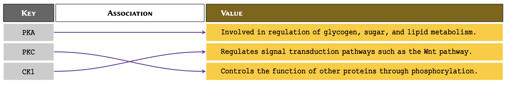

:::::::::::::::::::::::::::::::::::::: questions 

- How is a dictionary defined in Python?
- What are the ways to interact with a dictionary?
- Can a dictionary be nested?

::::::::::::::::::::::::::::::::::::::::::::::::

::::::::::::::::::::::::::::::::::::: objectives

- Understanding the structure of a dictionary.
- Accessing data from a dictionary.
- Practising nested dictionaries to deal with complex data.
::::::::::::::::::::::::::::::::::::::::::::::::

::::::::::::::::::::::::::::::::::::: keypoints 

- Dictionaries associate a set of *values* with a number of *keys*.
- *keys* are used to access the values of a dictionary.
- Dictionaries are mutable.
- Nested dictionaries are constructed to organise data in a hierarchical fashion.
- Some of the useful methods to work with dictionaries are: <kbd>.items()</kbd>, <kbd>.get()</kbd>

::::::::::::::::::::::::::::::::::::::::::::::::

## Dictionary 

One of the most useful built-in tools in Python, dictionaries associate a set of *values* with a number of *keys*. 

Think of an old fashion, paperback dictionary where we have a range of words with their definitions. The words are the *keys*, and the definitions are the *values* that are associated with the keys. A Python dictionary works in the same way. 


Consider the following scenario:


>Suppose we have a number of protein kinases, and we would like to associate them with their descriptions for future reference.


This is an example of association in arrays. We may visualise this problem as displayed below:



One way to associate the proteins with their definitions would be to use nested arrays. However, it would make it difficult to retrieve the values at a later time. This is because to retrieve the values, we would need to know the index at which a given protein is stored. 

Instead of using normal arrays, in such circumstances, we use *associative arrays*. The most popular method to create construct an associative array in Python is to create dictionaries or ```dict```.

:::::::::::::::::::::::::::::::::::: callout
## Remember	

To implement a `dict` in Python, we place our entries in curly bracket, separated using a comma. We separate *keys* and *values* using a colon --- e.g.  {<span style="color: rgb(32, 121, 77);">'key'</span>: <span style="color: rgb(32, 121, 77);">'value'</span>}. The combination of dictionary *key* and its associating *value* is known as a dictionary *item*. 
	
:::::::::::::::::::::::::::::::::::: 

:::::::::::::::::::::::::::::::::::: callout
## Note	
When constructing a long `dict` with several *items* that span over several lines, it is not necessary to write one *item* per line or use indentations for each *item* or line. All we must is to write the \emph{items} as {<span style="color: rgb(32, 121, 77);">'key'</span>: <span style="color: rgb(32, 121, 77);">'value'</span>} in curly brackets and separate each pair with a comma. However, it is good practice to write one *item* per line and use indentations as it makes it considerably easier to read the code and understand the hierarchy.
	
::::::::::::::::::::::::::::::::::::

	
We can therefore implement the diagram displayed above in Python as follows:

```python

protein_kinases = {
  'PKA': 'Involved in regulation of glycogen, sugar, and lipid metabolism.',
  'PKC': 'Regulates signal transduction pathways such as the Wnt pathway.',
  'CK1': 'Controls the function of other proteins through phosphorylation.'
  }
	
print(protein_kinases)
```

```output
{'PKA': 'Involved in regulation of glycogen, sugar, and lipid metabolism.', 'PKC': 'Regulates signal transduction pathways such as the Wnt pathway.', 'CK1': 'Controls the function of other proteins through phosphorylation.'}
```
```python
print(type(protein_kinases))
```	
```output
<class 'dict'>
```

:::::::::::::::::::::::::::::: challenge 

## Constructing dictionaries
Use [Universal Protein Resource](https://uniprot.org/) (UniProt) to find the following proteins for humans:
  - Axin-1
	- Rhodopsin
	
Construct a dictionary for these proteins and the number amino acids for each of them. The *keys* should represent the name of the protein. Display the result.	
	
::::::::::::::::: solution

## solution 
```python
proteins = {
  'Axin-1': 862,
  'Rhodopsin': 348
  }
		
print(proteins)
```
```output
{'Axin-1': 862, 'Rhodopsin': 348}
```

:::::::::::::::::

::::::::::::::::::::::::::::::: 

Now that we have created a dictionary; we can test whether or not a specific *key* exists our dictionary:


```python
'CK1' in protein_kinases
```

```output
True
```
	
```python
'GSK3' in protein_kinases
```

```output
False
```
:::::::::::::::::::::::::::::: challenge 
## Using `in`

Using the `proteins` dictionary you created in the above challenge, test to see whether or not a protein called **ERK** exists as a *key* in your dictionary? Display the result as a Boolean value.
	
	
::::::::::::::::: solution
```python
print('ERK' in proteins)
```

```output
False
```

:::::::::::::::::

::::::::::::::::::::::::::::::: 

### Interacting with a dictionary
We have already learnt that in programming, the more explicit our code, the better it is. Interacting with dictionaries in Python is very easy, coherent, and explicit. This makes them a powerful tool that we can exploit for different purposes.

In `list`s and `tuple`s, we use indexing and slicing to retrieve *values*. In dictionaries, however, we use *keys* to do that. Because we can define the *keys* of a dictionary ourselves, we no longer have to rely exclusively on numeric indices.  

As a result, we can retrieve the *values* of a dictionary using their respective *keys* as follows:

```python
print(protein_kinases['CK1'])
```

```output
Controls the function of other proteins through phosphorylation.
```

However, if we attempt to retrieve the *value* for a *key* that does not exist in our `dict`, a `KeyError` will be raised: 

```python
'GSK3' in protein_kinases

print(protein_kinases['GSK3'])
```
```error
Error in py_call_impl(callable, dots$args, dots$keywords): KeyError: 'GSK3'

Detailed traceback:
  File "<string>", line 1, in <module>
```

:::::::::::::::::::::::::::::: challenge 

## Dictionary lookup

Implement a ```dict``` to represent the following set of information:

**Cystic Fibrosis:**

| **Full Name** | **Gene** | **Type**  |  
|:---------------------------:|:---:|:---:|
| Cystic fibrosis transmembrane conductance regulator | CFTR | Membrane Protein |
	
Using the dictionary you implemented, retrieve and display the *gene* associated with cystic fibrosis.	

::::::::::::::::: solution
	
```python
cystic_fibrosis = {
  'full name': 'Cystic fibrosis transmembrane conductance regulator',
  'gene': 'CFTR',
  'type': 'Membrane Protein'
  }
		
print(cystic_fibrosis['gene'])
```		

```output
CFTR
```

:::::::::::::::::

::::::::::::::::::::::::::::::: 

:::::::::::::::::::::::::::::::::::: callout
## Remember	
Whilst the *values* in a ```dict``` can be of virtually any type supported in Python, the *keys* may only be defined using immutable types such as `string`, `int`, or `tuple`. Additionally, the *keys* in a dictionary must be unique.
	
:::::::::::::::::::::::::::::::::::: 

If we attempt to construct a ```dict``` using a mutable value as *key*, a ```TypeError``` will be raised.

For instance, ```list``` is a mutable type and therefore cannot be used as a *key*:

```python
test_dict = {
  ['a', 'b']: 'some value'
  }
```

```error
Error in py_call_impl(callable, dots$args, dots$keywords): TypeError: unhashable type: 'list'

Detailed traceback:
  File "<string>", line 1, in <module>
```

But we can use any immutable type as a *key*:

```python
test_dict = {
  'ab': 'some value'
  }
  
print(test_dict)
```

```output
{'ab': 'some value'}
```
	
```python
test_dict = {
  ('a', 'b'): 'some value'
  }
  
print(test_dict)  
```

```output
{('a', 'b'): 'some value'}
```

If we define a *key* more than once, the Python interpreter constructs the entry in ```dict``` using the last instance. 

In the following example, we repeat the *key* <span style="color: rgb(32, 121, 77);">'pathway'</span> twice; and as expected, the interpreter only uses the last instance, which in this case represents the value <span style="color: rgb(32, 121, 77);">'Canonical'</span>:

```python
signal = {
  'name': 'Wnt', 
  'pathway': 'Non-Canonical',  # first instance
  'pathway': 'Canonical'  # second instance
  }

print(signal)	
```	

```
{'name': 'Wnt', 'pathway': 'Canonical'}
```

### Dictionaries are mutable
Dictionaries are mutable. This means that we can alter their contents. We can make any alterations to a dictionary as long as we use *immutable* values for the *keys*. 

Suppose we have a dictionary stored in a variable called ```protein```, holding some information about a specific protein:

```python
protein = {
  'full name': 'Cystic fibrosis transmembrane conductance regulator', 
  'alias': 'CFTR',
  'gene': 'CFTR',
  'type': 'Membrane Protein',
  'common mutations': ['Delta-F508', 'G542X', 'G551D', 'N1303K']
  }
```

We can add new *items* to our dictionary or alter the existing ones:

```python
# Adding a new item:
protein['chromosome'] = 7
	
print(protein)

print(protein['chromosome'])
```
```output
{'full name': 'Cystic fibrosis transmembrane conductance regulator', 'alias': 'CFTR', 'gene': 'CFTR', 'type': 'Membrane Protein', 'common mutations': ['Delta-F508', 'G542X', 'G551D', 'N1303K'], 'chromosome': 7}
7
```

We can also alter an existing *value* in a dictionary using its *key*. To do so, we simply access the *value* using its *key*, and treat it as a normal variable; i.e. the same way we do with members of a ```list```:

```python
print(protein['common mutations'])
```

```output
['Delta-F508', 'G542X', 'G551D', 'N1303K']
```

```python
protein['common mutations'].append('W1282X')
print(protein)
```
```output
{'full name': 'Cystic fibrosis transmembrane conductance regulator', 'alias': 'CFTR', 'gene': 'CFTR', 'type': 'Membrane Protein', 'common mutations': ['Delta-F508', 'G542X', 'G551D', 'N1303K', 'W1282X'], 'chromosome': 7}
```
:::::::::::::::::::::::::::::: challenge 

## Altering values

Implement the following dictionary:

```
signal = {'name': 'Wnt', 'pathway': 'Non-Canonical'}}
	
```

with respect to <span style="color: rgb(32, 121, 77);">signal</span>:

   - Correct the *value* of <span style="color: rgb(32, 121, 77);">pathway</span> to "Canonical";
   - Add a new *item* to the dictionary to represent the *receptors* for the canonical pathway as  "Frizzled" and "LRP".  
   
Display the altered dictionary as the final result.

::::::::::::::::: solution
	
```python
signal = {'name': 'Wnt', 'pathway': 'Non-Canonical'}
	
signal['pathway'] = 'Canonical'
signal['receptors'] = ('Frizzled', 'LRP')
	
print(signal)
```
```output
{'name': 'Wnt', 'pathway': 'Canonical', 'receptors': ('Frizzled', 'LRP')}
```

:::::::::::::::::

::::::::::::::::::::::::::::::: 

:::::::::::::::::::::::::::::::::::: callout
## Advanced Topic	
Displaying an entire dictionary using the <kbd>print()</kbd> function can look a little messy because it is not properly structured. There is, however, an external library called ```pprint``` (Pretty-Print) that behaves in very similar way to the default <kbd>print()</kbd> function, but structures dictionaries and other arrays in a more presentable way before displaying them. We do not discuss ``Pretty-Print'' in this course, but it is a part of Python's default library and is therefore installed with Python automatically. To learn more it, have a read through the [official documentations](https://docs.python.org/3/library/pprint.html\#module-pprint) for the library and review the [examples](https://docs.python.org/3/library/pprint.html\#example).
	
:::::::::::::::::::::::::::::::::::: 

Because the *keys* are immutable, they cannot be altered. However, we can get around this limitation by introducing a new *key* and assigning the *values* of the old *key* to the new one. Once we do that, we can go ahead and *remove* the old *item*. The easiest way to remove an *item* from a dictionary is to use the syntax <kbd>del</kbd>:

```python
# Creating a new key and assigning to it the 
# values of the old key:
protein['human chromosome'] = protein['chromosome']

print(protein)
```

```output
{'full name': 'Cystic fibrosis transmembrane conductance regulator', 'alias': 'CFTR', 'gene': 'CFTR', 'type': 'Membrane Protein', 'common mutations': ['Delta-F508', 'G542X', 'G551D', 'N1303K', 'W1282X'], 'chromosome': 7, 'human chromosome': 7}
```

```python
# Now we remove the old item from the dictionary:
del protein['chromosome']

print(protein)
```

```output
{'full name': 'Cystic fibrosis transmembrane conductance regulator', 'alias': 'CFTR', 'gene': 'CFTR', 'type': 'Membrane Protein', 'common mutations': ['Delta-F508', 'G542X', 'G551D', 'N1303K', 'W1282X'], 'human chromosome': 7}
```

We can simplify the above operation using the <kbd>.pop()</kbd> method, which removes the specified *key* from a dictionary and returns any *values* associated with it:

```python
protein['common mutations in caucasians'] = protein.pop('common mutations')

print(protein)
```

```output
{'full name': 'Cystic fibrosis transmembrane conductance regulator', 'alias': 'CFTR', 'gene': 'CFTR', 'type': 'Membrane Protein', 'human chromosome': 7, 'common mutations in caucasians': ['Delta-F508', 'G542X', 'G551D', 'N1303K', 'W1282X']}
```

::::::::::::::::::::::::::::::: challenge 

## Reassigning values

Implement a dictionary as:

```python
signal = {'name': 'Beta-Galactosidase', 'pdb': '4V40'}
```

with respect to <span style="color: rgb(32, 121, 77);">signal</span>:

   - Change the *key* name from <span style="color: rgb(32, 121, 77);">'pdb'</span> to <span style="color: rgb(32, 121, 77);">'pdb id '</span> using the <kbd>.pop()</kbd> method. 
   - Write a code to find out whether the dictionary:

        - contains the new *key* (i.e. <span style="color: rgb(32, 121, 77);">'pdb id '</span>). 
        - confirm that it no longer contains the old *key* (i.e. <span style="color: rgb(32, 121, 77);">'pdb'</span>) 

If both conditions are met, display:
```
Contains the new key, but not the old one.
```
Otherwise:
```
Failed to alter the dictionary.
```

::::::::::::::::: solution

```python
signal = {
		    'name': 'Beta-Galactosidase', 
		    'pdb': '4V40'
	}
	
signal['pdb id'] = signal.pop('pdb')
	
if 'pdb id' in signal and 'pdb' not in signal:
    print('Contains the new key, but not the old one.')
else:
    print('Failed to alter the dictionary.')
    
```

```output
Contains the new key, but not the old one.
```

:::::::::::::::::

::::::::::::::::::::::::::::::: 

### **Useful methods for dictionary** 
Now we use some snippets to demonstrate some of the useful *methods* associated with ```dict``` in Python.

Given a dictionary as:

```python
lac_repressor = {
	    'pdb id': '1LBI',
	    'deposit data': '1996-02-17',
	    'organism': 'Escherichia coli',
	    'method': 'x-ray',
	    'resolution': 2.7,
}
```

We can create an array of all *items* in the dictionary using the <kbd>.items()</kbd> method:

```python
print(lac_repressor.items())
```
```output
dict_items([('pdb id', '1LBI'), ('deposit data', '1996-02-17'), ('organism', 'Escherichia coli'), ('method', 'x-ray'), ('resolution', 2.7)])
```

The <kbd>.items()</kbd> method also returns an array of ```tuple``` members. Each ```tuple``` itself consists of 2 members, and is structured as (<span style="color: rgb(32, 121, 77);">'key'</span>: <span style="color: rgb(32, 121, 77);">'value'</span>). On that account, we can use its output in the context of a ```for```--loop as follows: 

```python
for key, value in lac_repressor.items():
    print(key, value, sep=': ')
```
```output
pdb id: 1LBI
deposit data: 1996-02-17
organism: Escherichia coli
method: x-ray
resolution: 2.7
```

We learned earlier that if we ask for a *key* that is not in the ```dict```, a ```KeyError``` will be raised. If we anticipate this, we can handle it using the <kbd>.get()</kbd> method. The method takes in the *key* and searches the dictionary to find it. If found, the associating *value* is returned. Otherwise, the method returns ```None``` by default. We can also pass a second value to <kbd>.get()</kbd> to replace ```None``` in cases that the requested *key* does not exist:

```python
print(lac_repressor['gene'])
```
```output
Error in py_call_impl(callable, dots$args, dots$keywords): KeyError: 'gene'

Detailed traceback:
  File "<string>", line 1, in <module>
```

```python
print(lac_repressor.get('gene'))
```

```output
None
```

```python
print(lac_repressor.get('gene', 'Not found...'))
```
```output
Not found...
```
::::::::::::::::::::::::::::::: challenge 

## Getting multiple values

Implement the <span style="color: rgb(32, 121, 77);">lac_repressor</span> dictionary and try to extract the *values* associated with the following *keys*:

- <span style="color: rgb(32, 121, 77);">organism</span>
- <span style="color: rgb(32, 121, 77);">authors</span>
- <span style="color: rgb(32, 121, 77);">subunits</span>
- <span style="color: rgb(32, 121, 77);">method</span>

If a *key* does not exist in the dictionary, display <span style="color: rgb(32, 121, 77);">No entry</span> instead.

Display the results in the following format:
```
organism: XXX
authors: XXX	
```

::::::::::::::::: solution
	
## DIY ANSWER
```python
lac_repressor = {
    'pdb id': '1LBI',
    'deposit data': '1996-02-17',
    'organism': 'Escherichia coli',
    'method': 'x-ray',
    'resolution': 2.7,
}
	
requested_keys = ['organism', 'authors', 'subunits', 'method']
	
for key in requested_keys:
    lac_repressor.get(key, 'No entry')
```

```output
'Escherichia coli'
'No entry'
'No entry'
'x-ray'
```

:::::::::::::::::

::::::::::::::::::::::::::::::: 
### ```for```-loops and dictionaries
Dictionaries and ```for```-loops create a powerful combination. We can leverage the accessibility of dictionary *values* through specific *keys* that we define ourselves in a loop to extract data iteratively and repeatedly. 

One of the most useful tools that we can create using nothing more than a ```for```-loop and a dictionary, in only a few lines of code, is a sequence converter.

Here, we are essentially iterating through a sequence of DNA nucleotides (<span style="color: rgb(32, 121, 77);">sequence</span>), extracting one character per loop cycle from our string (<span style="color: rgb(32, 121, 77);">nucleotide</span>). We then use that character as a *key* to retrieve its corresponding *value* from our a dictionary (<span style="color: rgb(32, 121, 77);">dna2rna</span>). Once we get the *value*, we add it to the variable that we initialised using an empty string outside the scope of our ```for```-loop (<span style="color: rgb(32, 121, 77);">rna_sequence</span>). At the end of the process, the variable <span style="color: rgb(32, 121, 77);">rna_sequence</span> will contain a converted version of our sequence. 

```python
sequence = 'CCCATCTTAAGACTTCACAAGACTTGTGAAATCAGACCACTGCTCAATGCGGAACGCCCG'
	
dna2rna = {"A": "U", "T": "A", "C": "G", "G": "C"}
	
rna_sequence = str()  # Creating an empty string.
	
for nucleotide in sequence:
    rna_sequence += dna2rna[nucleotide]
	
print('DNA:', sequence)
print('RNA:', rna_sequence)
```

```output
DNA: CCCATCTTAAGACTTCACAAGACTTGTGAAATCAGACCACTGCTCAATGCGGAACGCCCG
RNA: GGGUAGAAUUCUGAAGUGUUCUGAACACUUUAGUCUGGUGACGAGUUACGCCUUGCGGGC
```

::::::::::::::::::::::::::::::: challenge 

## Using dictionaries as maps

We know that in reverse transcription, RNA nucleotides are converted to their complementary DNA as shown:
	
| Type | Direction | Nucleotides  |  
|:---------------------------:|:---:|:---:|
| RNA | 5'...' | U A G C |
| cDNA | 5'...' | A T C G |

with that in mind:

1. Use the table to construct a dictionary for reverse transcription, and another dictionary for the conversion of cDNA to DNA. 

2. Using the appropriate dictionary, convert the following mRNA (exon) sequence for human G protein-coupled receptor to its cDNA.

```python
human_gpcr = (
    'AUGGAUGUGACUUCCCAAGCCCGGGGCGUGGGCCUGGAGAUGUACCCAGGCACCGCGCAGCCUGCGGCCCCCAACACCACCUC'
    'CCCCGAGCUCAACCUGUCCCACCCGCUCCUGGGCACCGCCCUGGCCAAUGGGACAGGUGAGCUCUCGGAGCACCAGCAGUACG'
    'UGAUCGGCCUGUUCCUCUCGUGCCUCUACACCAUCUUCCUCUUCCCCAUCGGCUUUGUGGGCAACAUCCUGAUCCUGGUGGUG'
    'AACAUCAGCUUCCGCGAGAAGAUGACCAUCCCCGACCUGUACUUCAUCAACCUGGCGGUGGCGGACCUCAUCCUGGUGGCCGA'
    'CUCCCUCAUUGAGGUGUUCAACCUGCACGAGCGGUACUACGACAUCGCCGUCCUGUGCACCUUCAUGUCGCUCUUCCUGCAGG'
    'UCAACAUGUACAGCAGCGUCUUCUUCCUCACCUGGAUGAGCUUCGACCGCUACAUCGCCCUGGCCAGGGCCAUGCGCUGCAGC'
    'CUGUUCCGCACCAAGCACCACGCCCGGCUGAGCUGUGGCCUCAUCUGGAUGGCAUCCGUGUCAGCCACGCUGGUGCCCUUCAC'
    'CGCCGUGCACCUGCAGCACACCGACGAGGCCUGCUUCUGUUUCGCGGAUGUCCGGGAGGUGCAGUGGCUCGAGGUCACGCUGG'
    'GCUUCAUCGUGCCCUUCGCCAUCAUCGGCCUGUGCUACUCCCUCAUUGUCCGGGUGCUGGUCAGGGCGCACCGGCACCGUGGG'
    'CUGCGGCCCCGGCGGCAGAAGGCGCUCCGCAUGAUCCUCGCGGUGGUGCUGGUCUUCUUCGUCUGCUGGCUGCCGGAGAACGU'
    'CUUCAUCAGCGUGCACCUCCUGCAGCGGACGCAGCCUGGGGCCGCUCCCUGCAAGCAGUCUUUCCGCCAUGCCCACCCCCUCA'
    'CGGGCCACAUUGUCAACCUCACCGCCUUCUCCAACAGCUGCCUAAACCCCCUCAUCUACAGCUUUCUCGGGGAGACCUUCAGG'
    'GACAAGCUGAGGCUGUACAUUGAGCAGAAAACAAAUUUGCCGGCCCUGAACCGCUUCUGUCACGCUGCCCUGAAGGCCGUCAU'
    'UCCAGACAGCACCGAGCAGUCGGAUGUGAGGUUCAGCAGUGCCGUG'
)
```

	
::::::::::::::::: solution

Q1:

```python
mrna2cdna = {
    'U': 'A',
    'A': 'T',
    'G': 'C',
    'C': 'G'
}
		
cdna2dna = {
    'A': 'T',
    'T': 'A',
    'C': 'G',
    'G': 'C'
}
```

Q2:

```python
cdna = str()
for nucleotide in human_gpcr:
    cdna += mrna2cdna[nucleotide]
		
print(cdna)
```

```output
TACCTACACTGAAGGGTTCGGGCCCCGCACCCGGACCTCTACATGGGTCCGTGGCGCGTCGGACGCCGGGGGTTGTGGTGGAGGGGGCTCGAGTTGGACAGGGTGGGCGAGGACCCGTGGCGGGACCGGTTACCCTGTCCACTCGAGAGCCTCGTGGTCGTCATGCACTAGCCGGACAAGGAGAGCACGGAGATGTGGTAGAAGGAGAAGGGGTAGCCGAAACACCCGTTGTAGGACTAGGACCACCACTTGTAGTCGAAGGCGCTCTTCTACTGGTAGGGGCTGGACATGAAGTAGTTGGACCGCCACCGCCTGGAGTAGGACCACCGGCTGAGGGAGTAACTCCACAAGTTGGACGTGCTCGCCATGATGCTGTAGCGGCAGGACACGTGGAAGTACAGCGAGAAGGACGTCCAGTTGTACATGTCGTCGCAGAAGAAGGAGTGGACCTACTCGAAGCTGGCGATGTAGCGGGACCGGTCCCGGTACGCGACGTCGGACAAGGCGTGGTTCGTGGTGCGGGCCGACTCGACACCGGAGTAGACCTACCGTAGGCACAGTCGGTGCGACCACGGGAAGTGGCGGCACGTGGACGTCGTGTGGCTGCTCCGGACGAAGACAAAGCGCCTACAGGCCCTCCACGTCACCGAGCTCCAGTGCGACCCGAAGTAGCACGGGAAGCGGTAGTAGCCGGACACGATGAGGGAGTAACAGGCCCACGACCAGTCCCGCGTGGCCGTGGCACCCGACGCCGGGGCCGCCGTCTTCCGCGAGGCGTACTAGGAGCGCCACCACGACCAGAAGAAGCAGACGACCGACGGCCTCTTGCAGAAGTAGTCGCACGTGGAGGACGTCGCCTGCGTCGGACCCCGGCGAGGGACGTTCGTCAGAAAGGCGGTACGGGTGGGGGAGTGCCCGGTGTAACAGTTGGAGTGGCGGAAGAGGTTGTCGACGGATTTGGGGGAGTAGATGTCGAAAGAGCCCCTCTGGAAGTCCCTGTTCGACTCCGACATGTAACTCGTCTTTTGTTTAAACGGCCGGGACTTGGCGAAGACAGTGCGACGGGACTTCCGGCAGTAAGGTCTGTCGTGGCTCGTCAGCCTACACTCCAAGTCGTCACGGCAC
```

:::::::::::::::::

::::::::::::::::::::::::::::::: 


