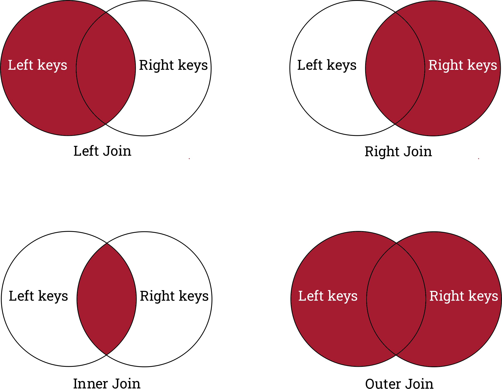

:::::::::::::::::::::::::::::::::::::: questions 

- How can I combine dataframes?
- How do I handle missing or incomplete data mappings?

::::::::::::::::::::::::::::::::::::::::::::::::

::::::::::::::::::::::::::::::::::::: objectives

- Determine which kind of combination is desired between two dataframes. 
- Combine two dataframes row-wise or column-wise. 
- Identify the different types of joins. 

::::::::::::::::::::::::::::::::::::::::::::::::

::::::::::::::::::::::::::::::::::::: keypoints

- Concatenate dataframes to add additional *rows*. 
- Merge/join data frames to add additional *columns*.
- Change the `on` argument to choose what is matched between dataframes when joining. 
- The different types of joins control how missing data is handled for the left and right dataframes.
::::::::::::::::::::::::::::::::::::::::::::::::

There are a variety of ways we might want to combine data when performing a data analysis. 
We can generally group these into **concatenating** (sometimes called *appending*) and **merging** (sometimes called *joining*). 

We will continue to use the rnaseq dataset:

```python
import pandas as pd

url = "https://raw.githubusercontent.com/ccb-hms/workbench-python-workshop/main/episodes/data/rnaseq.csv"
rnaseq_df = pd.read_csv(url, index_col=0)
```

## Concatenate dataframes to add additional *rows*. 

When we want to combine two dataframes by adding one as additional rows, we concatenate them together. 
This if often the case if our observations are spread out over multiple files. 
To simulate this, let's make two miniature versions of `rnaseq_df`` with the first and last 10 rows of the data:

```python
rnaseq_mini = rnaseq_df.loc[:,["sample", "expression"]].head(10)
rnaseq_mini_tail = rnaseq_df.loc[:,["sample", "expression"]].tail(10)
print(rnaseq_mini)
print(rnaseq_mini_tail)
```

```output
             sample  expression
gene                           
Asl      GSM2545336        1170
Apod     GSM2545336       36194
Cyp2d22  GSM2545336        4060
Klk6     GSM2545336         287
Fcrls    GSM2545336          85
Slc2a4   GSM2545336         782
Exd2     GSM2545336        1619
Gjc2     GSM2545336         288
Plp1     GSM2545336       43217
Gnb4     GSM2545336        1071
             sample  expression
gene                           
Dusp27   GSM2545380          15
Mael     GSM2545380           4
Gm16418  GSM2545380          16
Gm16701  GSM2545380         181
Aldh9a1  GSM2545380        1770
Mgst3    GSM2545380        2151
Lrrc52   GSM2545380           5
Rxrg     GSM2545380          49
Lmx1a    GSM2545380          72
Pbx1     GSM2545380        4795
```

We can then concatenate the dataframes using the pandas function `concat`. 

```python
combined_df = pd.concat([rnaseq_mini, rnaseq_mini_tail])
print(combined_df)
```

```output
             sample  expression
gene                           
Asl      GSM2545336        1170
Apod     GSM2545336       36194
Cyp2d22  GSM2545336        4060
Klk6     GSM2545336         287
Fcrls    GSM2545336          85
Slc2a4   GSM2545336         782
Exd2     GSM2545336        1619
Gjc2     GSM2545336         288
Plp1     GSM2545336       43217
Gnb4     GSM2545336        1071
Dusp27   GSM2545380          15
Mael     GSM2545380           4
Gm16418  GSM2545380          16
Gm16701  GSM2545380         181
Aldh9a1  GSM2545380        1770
Mgst3    GSM2545380        2151
Lrrc52   GSM2545380           5
Rxrg     GSM2545380          49
Lmx1a    GSM2545380          72
Pbx1     GSM2545380        4795
```

We now have 20 rows in our combined dataset, and the same number of columns. 
Note that `concat` is a *function* of the `pd` module, as opposed to a dataframe method. 
It takes in a list of dataframes, and outputs a combined dataframe. 

If one dataframe has columns which don't exist in the other, these values are filled in with `NaN`. 

```python
rnaseq_mini_time = rnaseq_df.loc[:,["sample", "expression","time"]].iloc[10:20,:]
print(rnaseq_mini_time)
```

```output
            sample  expression  time
gene                                
Tnc     GSM2545336         219     8
Trf     GSM2545336        9719     8
Tubb2b  GSM2545336        2245     8
Fads1   GSM2545336        6498     8
Lxn     GSM2545336        1744     8
Prr18   GSM2545336        1284     8
Cmtm5   GSM2545336        1381     8
Enpp1   GSM2545336         388     8
Clic4   GSM2545336        5795     8
Tm6sf2  GSM2545336          32     8
```

```python
mini_dfs = [rnaseq_mini, rnaseq_mini_time, rnaseq_mini_tail]
combined_df = pd.concat(mini_dfs)
print(combined_df)
```

```output
             sample  expression  time
gene                                 
Asl      GSM2545336        1170   NaN
Apod     GSM2545336       36194   NaN
Cyp2d22  GSM2545336        4060   NaN
Klk6     GSM2545336         287   NaN
Fcrls    GSM2545336          85   NaN
Slc2a4   GSM2545336         782   NaN
Exd2     GSM2545336        1619   NaN
Gjc2     GSM2545336         288   NaN
Plp1     GSM2545336       43217   NaN
Gnb4     GSM2545336        1071   NaN
Tnc      GSM2545336         219   8.0
Trf      GSM2545336        9719   8.0
Tubb2b   GSM2545336        2245   8.0
Fads1    GSM2545336        6498   8.0
Lxn      GSM2545336        1744   8.0
Prr18    GSM2545336        1284   8.0
Cmtm5    GSM2545336        1381   8.0
Enpp1    GSM2545336         388   8.0
Clic4    GSM2545336        5795   8.0
Tm6sf2   GSM2545336          32   8.0
Dusp27   GSM2545380          15   NaN
Mael     GSM2545380           4   NaN
Gm16418  GSM2545380          16   NaN
Gm16701  GSM2545380         181   NaN
Aldh9a1  GSM2545380        1770   NaN
Mgst3    GSM2545380        2151   NaN
Lrrc52   GSM2545380           5   NaN
Rxrg     GSM2545380          49   NaN
Lmx1a    GSM2545380          72   NaN
Pbx1     GSM2545380        4795   NaN
```

## Merge or join data frames to add additional *columns*. 

As opposed to concatenating data, we instead might want to add additional columns to a dataframe. 
We've already seen how to add a new column based on a calculation, but often we have some other data table we want to combine. 

If we know that the rows are in the same order, we can use the same syntax we use to assign new columns. 
However, this is often not the case.

```python
# There is an ongoing idelogical debate among developers whether variables like this should be named:
# url1, url2, and url3
# url0, url1, and url2 or
# url, url2, and url3
url1 = "https://raw.githubusercontent.com/ccb-hms/workbench-python-workshop/main/episodes/data/annot1.csv"
url2 = "https://raw.githubusercontent.com/ccb-hms/workbench-python-workshop/main/episodes/data/annot2.csv"
url3 = "https://raw.githubusercontent.com/ccb-hms/workbench-python-workshop/main/episodes/data/annot3.csv"

# Here .sample is being used to shuffle the dataframe rows into a random order
annot1 = pd.read_csv(url1, index_col=0).sample(frac=1)
annot2 = pd.read_csv(url2, index_col=0).sample(frac=1)
annot3 = pd.read_csv(url3, index_col=0).sample(frac=1)
print(annot1)
```

```output
                                          gene_description
gene                                                      
Fcrls    Fc receptor-like S, scavenger receptor [Source...
Plp1     proteolipid protein (myelin) 1 [Source:MGI Sym...
Apod     apolipoprotein D [Source:MGI Symbol;Acc:MGI:88...
Klk6     kallikrein related-peptidase 6 [Source:MGI Sym...
Gnb4     guanine nucleotide binding protein (G protein)...
Cyp2d22  cytochrome P450, family 2, subfamily d, polype...
Slc2a4   solute carrier family 2 (facilitated glucose t...
Asl      argininosuccinate lyase [Source:MGI Symbol;Acc...
Gjc2     gap junction protein, gamma 2 [Source:MGI Symb...
Exd2     exonuclease 3'-5' domain containing 2 [Source:...
```

```python
print(rnaseq_mini.join(annot1))
```

```output
             sample  expression  \
gene                              
Asl      GSM2545336        1170   
Apod     GSM2545336       36194   
Cyp2d22  GSM2545336        4060   
Klk6     GSM2545336         287   
Fcrls    GSM2545336          85   
Slc2a4   GSM2545336         782   
Exd2     GSM2545336        1619   
Gjc2     GSM2545336         288   
Plp1     GSM2545336       43217   
Gnb4     GSM2545336        1071   

                                          gene_description  
gene                                                        
Asl      argininosuccinate lyase [Source:MGI Symbol;Acc...  
Apod     apolipoprotein D [Source:MGI Symbol;Acc:MGI:88...  
Cyp2d22  cytochrome P450, family 2, subfamily d, polype...  
Klk6     kallikrein related-peptidase 6 [Source:MGI Sym...  
Fcrls    Fc receptor-like S, scavenger receptor [Source...  
Slc2a4   solute carrier family 2 (facilitated glucose t...  
Exd2     exonuclease 3'-5' domain containing 2 [Source:...  
Gjc2     gap junction protein, gamma 2 [Source:MGI Symb...  
Plp1     proteolipid protein (myelin) 1 [Source:MGI Sym...  
Gnb4     guanine nucleotide binding protein (G protein)...  
```

We have combined the two dataframes to add the `gene_description` column. 
By default, `join` looks at the index column of the left and right dataframe, combining rows when it finds matches. 
The data used to determine which rows should be combined between the dataframes is referred to as what is being joined on, or the *keys*. 
Here, we would say we are joining on the index columns, or the index columns are the keys. 
The row order and column order depends on which dataframe is on the left.

```python
print(annot1.join(rnaseq_mini))
```

```output
                                          gene_description      sample  \
gene                                                                     
Fcrls    Fc receptor-like S, scavenger receptor [Source...  GSM2545336   
Plp1     proteolipid protein (myelin) 1 [Source:MGI Sym...  GSM2545336   
Apod     apolipoprotein D [Source:MGI Symbol;Acc:MGI:88...  GSM2545336   
Klk6     kallikrein related-peptidase 6 [Source:MGI Sym...  GSM2545336   
Gnb4     guanine nucleotide binding protein (G protein)...  GSM2545336   
Cyp2d22  cytochrome P450, family 2, subfamily d, polype...  GSM2545336   
Slc2a4   solute carrier family 2 (facilitated glucose t...  GSM2545336   
Asl      argininosuccinate lyase [Source:MGI Symbol;Acc...  GSM2545336   
Gjc2     gap junction protein, gamma 2 [Source:MGI Symb...  GSM2545336   
Exd2     exonuclease 3'-5' domain containing 2 [Source:...  GSM2545336   

         expression  
gene                 
Fcrls            85  
Plp1          43217  
Apod          36194  
Klk6            287  
Gnb4           1071  
Cyp2d22        4060  
Slc2a4          782  
Asl            1170  
Gjc2            288  
Exd2           1619  

```

And the index columns do not need to have the same name. 

```python
print(annot2)
```

```output
                                                          description
external_gene_name                                                   
Slc2a4              solute carrier family 2 (facilitated glucose t...
Gnb4                guanine nucleotide binding protein (G protein)...
Fcrls               Fc receptor-like S, scavenger receptor [Source...
Gjc2                gap junction protein, gamma 2 [Source:MGI Symb...
Klk6                kallikrein related-peptidase 6 [Source:MGI Sym...
Plp1                proteolipid protein (myelin) 1 [Source:MGI Sym...
Cyp2d22             cytochrome P450, family 2, subfamily d, polype...
Exd2                exonuclease 3'-5' domain containing 2 [Source:...
Apod                apolipoprotein D [Source:MGI Symbol;Acc:MGI:88...
Asl                 argininosuccinate lyase [Source:MGI Symbol;Acc...
```

```python
print(rnaseq_mini.join(annot2))
```

```output
             sample  expression  \
gene                              
Asl      GSM2545336        1170   
Apod     GSM2545336       36194   
Cyp2d22  GSM2545336        4060   
Klk6     GSM2545336         287   
Fcrls    GSM2545336          85   
Slc2a4   GSM2545336         782   
Exd2     GSM2545336        1619   
Gjc2     GSM2545336         288   
Plp1     GSM2545336       43217   
Gnb4     GSM2545336        1071   

                                               description  
gene                                                        
Asl      argininosuccinate lyase [Source:MGI Symbol;Acc...  
Apod     apolipoprotein D [Source:MGI Symbol;Acc:MGI:88...  
Cyp2d22  cytochrome P450, family 2, subfamily d, polype...  
Klk6     kallikrein related-peptidase 6 [Source:MGI Sym...  
Fcrls    Fc receptor-like S, scavenger receptor [Source...  
Slc2a4   solute carrier family 2 (facilitated glucose t...  
Exd2     exonuclease 3'-5' domain containing 2 [Source:...  
Gjc2     gap junction protein, gamma 2 [Source:MGI Symb...  
Plp1     proteolipid protein (myelin) 1 [Source:MGI Sym...  
Gnb4     guanine nucleotide binding protein (G protein)...  
```

`join` by default uses the indices of the dataframes it combines. 
To change this, we can use the `on` parameter.
For instance, let's say we want to combine our sample metadata back with `rnaseq_mini`. 

```python
url = "https://raw.githubusercontent.com/ccb-hms/workbench-python-workshop/main/episodes/data/metadata.csv"
metadata = pd.read_csv(url, index_col=0)
print(metadata)
```

```output
                organism  age     sex    infection   strain  time      tissue  \
sample                                                                          
GSM2545336  Mus musculus    8  Female   InfluenzaA  C57BL/6     8  Cerebellum   
GSM2545337  Mus musculus    8  Female  NonInfected  C57BL/6     0  Cerebellum   
GSM2545338  Mus musculus    8  Female  NonInfected  C57BL/6     0  Cerebellum   
GSM2545339  Mus musculus    8  Female   InfluenzaA  C57BL/6     4  Cerebellum   
GSM2545340  Mus musculus    8    Male   InfluenzaA  C57BL/6     4  Cerebellum   
GSM2545341  Mus musculus    8    Male   InfluenzaA  C57BL/6     8  Cerebellum   
GSM2545342  Mus musculus    8  Female   InfluenzaA  C57BL/6     8  Cerebellum   
GSM2545343  Mus musculus    8    Male  NonInfected  C57BL/6     0  Cerebellum   
GSM2545344  Mus musculus    8  Female   InfluenzaA  C57BL/6     4  Cerebellum   
GSM2545345  Mus musculus    8    Male   InfluenzaA  C57BL/6     4  Cerebellum   
GSM2545346  Mus musculus    8    Male   InfluenzaA  C57BL/6     8  Cerebellum   
GSM2545347  Mus musculus    8    Male   InfluenzaA  C57BL/6     8  Cerebellum   
GSM2545348  Mus musculus    8  Female  NonInfected  C57BL/6     0  Cerebellum   
GSM2545349  Mus musculus    8    Male  NonInfected  C57BL/6     0  Cerebellum   
GSM2545350  Mus musculus    8    Male   InfluenzaA  C57BL/6     4  Cerebellum   
GSM2545351  Mus musculus    8  Female   InfluenzaA  C57BL/6     8  Cerebellum   
GSM2545352  Mus musculus    8  Female   InfluenzaA  C57BL/6     4  Cerebellum   
GSM2545353  Mus musculus    8  Female  NonInfected  C57BL/6     0  Cerebellum   
GSM2545354  Mus musculus    8    Male  NonInfected  C57BL/6     0  Cerebellum   
GSM2545362  Mus musculus    8  Female   InfluenzaA  C57BL/6     4  Cerebellum   
GSM2545363  Mus musculus    8    Male   InfluenzaA  C57BL/6     4  Cerebellum   
GSM2545380  Mus musculus    8  Female   InfluenzaA  C57BL/6     8  Cerebellum   

            mouse  
sample             
GSM2545336     14  
GSM2545337      9  
GSM2545338     10  
GSM2545339     15  
GSM2545340     18  
GSM2545341      6  
GSM2545342      5  
GSM2545343     11  
GSM2545344     22  
GSM2545345     13  
GSM2545346     23  
GSM2545347     24  
GSM2545348      8  
GSM2545349      7  
GSM2545350      1  
GSM2545351     16  
GSM2545352     21  
GSM2545353      4  
GSM2545354      2  
GSM2545362     20  
GSM2545363     12  
GSM2545380     19  
```

```python
print(rnaseq_mini.join(metadata, on="sample"))
```

```output
             sample  expression      organism  age     sex   infection  \
gene                                                                     
Asl      GSM2545336        1170  Mus musculus    8  Female  InfluenzaA   
Apod     GSM2545336       36194  Mus musculus    8  Female  InfluenzaA   
Cyp2d22  GSM2545336        4060  Mus musculus    8  Female  InfluenzaA   
Klk6     GSM2545336         287  Mus musculus    8  Female  InfluenzaA   
Fcrls    GSM2545336          85  Mus musculus    8  Female  InfluenzaA   
Slc2a4   GSM2545336         782  Mus musculus    8  Female  InfluenzaA   
Exd2     GSM2545336        1619  Mus musculus    8  Female  InfluenzaA   
Gjc2     GSM2545336         288  Mus musculus    8  Female  InfluenzaA   
Plp1     GSM2545336       43217  Mus musculus    8  Female  InfluenzaA   
Gnb4     GSM2545336        1071  Mus musculus    8  Female  InfluenzaA   

          strain  time      tissue  mouse  
gene                                       
Asl      C57BL/6     8  Cerebellum     14  
Apod     C57BL/6     8  Cerebellum     14  
Cyp2d22  C57BL/6     8  Cerebellum     14  
Klk6     C57BL/6     8  Cerebellum     14  
Fcrls    C57BL/6     8  Cerebellum     14  
Slc2a4   C57BL/6     8  Cerebellum     14  
Exd2     C57BL/6     8  Cerebellum     14  
Gjc2     C57BL/6     8  Cerebellum     14  
Plp1     C57BL/6     8  Cerebellum     14  
Gnb4     C57BL/6     8  Cerebellum     14  
```

Note that if we want to join on columns between dataframes which have different names we can simply rename the columns we wish to join on. 
If there is a reason we don't want to do this, we can instead use the more powerful but harder to use pandas [merge](https://pandas.pydata.org/docs/reference/api/pandas.DataFrame.merge.html?highlight=merge#pandas.DataFrame.merge) function. 

### Missing and duplicate data

In the above join, there were a few other things going on. 
The first is that multiple rows of `rnaseq_mini` contain the same sample. 
Pandas by default will repeat the rows wherever needed when joining. 

The second is that the `metadata` dataframe contains samples which are not present in `rnaseq_mini`. 
By default, they were dropped from the dataframe.
However, there might be cases where we want to keep our data. 
Let's explore how joining handles missing data with another example:

```python
print(annot3)
```

```output
                                          gene_description
gene                                                      
mt-Rnr1  mitochondrially encoded 12S rRNA [Source:MGI S...
mt-Rnr2  mitochondrially encoded 16S rRNA [Source:MGI S...
Slc2a4   solute carrier family 2 (facilitated glucose t...
Asl      argininosuccinate lyase [Source:MGI Symbol;Acc...
Exd2     exonuclease 3'-5' domain containing 2 [Source:...
Gnb4     guanine nucleotide binding protein (G protein)...
mt-Tl1   mitochondrially encoded tRNA leucine 1 [Source...
Apod     apolipoprotein D [Source:MGI Symbol;Acc:MGI:88...
mt-Tv    mitochondrially encoded tRNA valine [Source:MG...
Cyp2d22  cytochrome P450, family 2, subfamily d, polype...
mt-Tf    mitochondrially encoded tRNA phenylalanine [So...
Fcrls    Fc receptor-like S, scavenger receptor [Source...
Gjc2     gap junction protein, gamma 2 [Source:MGI Symb...
Plp1     proteolipid protein (myelin) 1 [Source:MGI Sym...
```

::: challenge
## Missing data in joins

What data is missing between `annot3` and `rnaseq_mini`?

Try joining them. 
How is this missing data handled?

::: solution

There are both genes in `annot3` but not in `rnaseq_mini`, and genes in `rnaseq_mini` not in `annot3`.

When we join, we keep rows from rnaseq_mini with missing data and drop rows from `annot3` with missing data. 

```python
print(rnaseq_mini.join(annot3))
```

```output
             sample  expression  \
gene                              
Asl      GSM2545336        1170   
Apod     GSM2545336       36194   
Cyp2d22  GSM2545336        4060   
Klk6     GSM2545336         287   
Fcrls    GSM2545336          85   
Slc2a4   GSM2545336         782   
Exd2     GSM2545336        1619   
Gjc2     GSM2545336         288   
Plp1     GSM2545336       43217   
Gnb4     GSM2545336        1071   

                                          gene_description  
gene                                                        
Asl      argininosuccinate lyase [Source:MGI Symbol;Acc...  
Apod     apolipoprotein D [Source:MGI Symbol;Acc:MGI:88...  
Cyp2d22  cytochrome P450, family 2, subfamily d, polype...  
Klk6                                                   NaN  
Fcrls    Fc receptor-like S, scavenger receptor [Source...  
Slc2a4   solute carrier family 2 (facilitated glucose t...  
Exd2     exonuclease 3'-5' domain containing 2 [Source:...  
Gjc2     gap junction protein, gamma 2 [Source:MGI Symb...  
Plp1     proteolipid protein (myelin) 1 [Source:MGI Sym...  
Gnb4     guanine nucleotide binding protein (G protein)...  
```

:::
:::

### Types of joins

The reason we see the above behavior is because by default pandas performs a **left join**.

We can change the type of join performed by changing the `how` argument of the `join` method. 



A **right join** saves all genes in the right dataframe, but drops and genes unique to `rnaseq_mini`. 

```python
print(rnaseq_mini.join(annot3, how = 'right'))
```

```output
             sample  expression  \
gene                              
Plp1     GSM2545336     43217.0   
Exd2     GSM2545336      1619.0   
Gjc2     GSM2545336       288.0   
mt-Rnr2         NaN         NaN   
Gnb4     GSM2545336      1071.0   
mt-Rnr1         NaN         NaN   
Apod     GSM2545336     36194.0   
Fcrls    GSM2545336        85.0   
mt-Tv           NaN         NaN   
mt-Tf           NaN         NaN   
Slc2a4   GSM2545336       782.0   
Cyp2d22  GSM2545336      4060.0   
mt-Tl1          NaN         NaN   
Asl      GSM2545336      1170.0   

                                          gene_description  
gene                                                        
Plp1     proteolipid protein (myelin) 1 [Source:MGI Sym...  
Exd2     exonuclease 3'-5' domain containing 2 [Source:...  
Gjc2     gap junction protein, gamma 2 [Source:MGI Symb...  
mt-Rnr2  mitochondrially encoded 16S rRNA [Source:MGI S...  
Gnb4     guanine nucleotide binding protein (G protein)...  
mt-Rnr1  mitochondrially encoded 12S rRNA [Source:MGI S...  
Apod     apolipoprotein D [Source:MGI Symbol;Acc:MGI:88...  
Fcrls    Fc receptor-like S, scavenger receptor [Source...  
mt-Tv    mitochondrially encoded tRNA valine [Source:MG...  
mt-Tf    mitochondrially encoded tRNA phenylalanine [So...  
Slc2a4   solute carrier family 2 (facilitated glucose t...  
Cyp2d22  cytochrome P450, family 2, subfamily d, polype...  
mt-Tl1   mitochondrially encoded tRNA leucine 1 [Source...  
Asl      argininosuccinate lyase [Source:MGI Symbol;Acc...  
```

An **inner join** only keeps genes shared by the dataframes, and drops all genes which are only in one dataframe. 

```python
print(rnaseq_mini.join(annot3, how = 'inner'))
```

```output
             sample  expression  \
gene                              
Asl      GSM2545336        1170   
Apod     GSM2545336       36194   
Cyp2d22  GSM2545336        4060   
Fcrls    GSM2545336          85   
Slc2a4   GSM2545336         782   
Exd2     GSM2545336        1619   
Gjc2     GSM2545336         288   
Plp1     GSM2545336       43217   
Gnb4     GSM2545336        1071   

                                          gene_description  
gene                                                        
Asl      argininosuccinate lyase [Source:MGI Symbol;Acc...  
Apod     apolipoprotein D [Source:MGI Symbol;Acc:MGI:88...  
Cyp2d22  cytochrome P450, family 2, subfamily d, polype...  
Fcrls    Fc receptor-like S, scavenger receptor [Source...  
Slc2a4   solute carrier family 2 (facilitated glucose t...  
Exd2     exonuclease 3'-5' domain containing 2 [Source:...  
Gjc2     gap junction protein, gamma 2 [Source:MGI Symb...  
Plp1     proteolipid protein (myelin) 1 [Source:MGI Sym...  
Gnb4     guanine nucleotide binding protein (G protein)...  
```

Finally, an **outer join** keeps all genes across both dataframes. 

```python
print(rnaseq_mini.join(annot3, how = 'outer'))
```

```output
             sample  expression  \
gene                              
Apod     GSM2545336     36194.0   
Asl      GSM2545336      1170.0   
Cyp2d22  GSM2545336      4060.0   
Exd2     GSM2545336      1619.0   
Fcrls    GSM2545336        85.0   
Gjc2     GSM2545336       288.0   
Gnb4     GSM2545336      1071.0   
Klk6     GSM2545336       287.0   
Plp1     GSM2545336     43217.0   
Slc2a4   GSM2545336       782.0   
mt-Rnr1         NaN         NaN   
mt-Rnr2         NaN         NaN   
mt-Tf           NaN         NaN   
mt-Tl1          NaN         NaN   
mt-Tv           NaN         NaN   

                                          gene_description  
gene                                                        
Apod     apolipoprotein D [Source:MGI Symbol;Acc:MGI:88...  
Asl      argininosuccinate lyase [Source:MGI Symbol;Acc...  
Cyp2d22  cytochrome P450, family 2, subfamily d, polype...  
Exd2     exonuclease 3'-5' domain containing 2 [Source:...  
Fcrls    Fc receptor-like S, scavenger receptor [Source...  
Gjc2     gap junction protein, gamma 2 [Source:MGI Symb...  
Gnb4     guanine nucleotide binding protein (G protein)...  
Klk6                                                   NaN  
Plp1     proteolipid protein (myelin) 1 [Source:MGI Sym...  
Slc2a4   solute carrier family 2 (facilitated glucose t...  
mt-Rnr1  mitochondrially encoded 12S rRNA [Source:MGI S...  
mt-Rnr2  mitochondrially encoded 16S rRNA [Source:MGI S...  
mt-Tf    mitochondrially encoded tRNA phenylalanine [So...  
mt-Tl1   mitochondrially encoded tRNA leucine 1 [Source...  
mt-Tv    mitochondrially encoded tRNA valine [Source:MG...   
```

::: challenge
## Duplicate column names

One common challenge we encounter when combining datasets from different sources is that they have identical column names. 

Imagine that you've collected a second set of observations from samples which are stored in a identically structured file. 
We can simulate this by generating some random numbers in a copy of `rnaseq_mini`.

```python
new_mini = rnaseq_mini.copy()
new_mini["expression"] = pd.Series(range(50,50000)).sample(int(10), replace=True).array
print(new_mini)
```
*Note: as these are pseudo-random numbers your exact values will be different*

```output
             sample  expression
gene                           
Asl      GSM2545336       48562
Apod     GSM2545336         583
Cyp2d22  GSM2545336       39884
Klk6     GSM2545336        6161
Fcrls    GSM2545336       10318
Slc2a4   GSM2545336       15991
Exd2     GSM2545336       44471
Gjc2     GSM2545336       40629
Plp1     GSM2545336       23146
Gnb4     GSM2545336       22506
```

Try joining `rnaseq_mini` and `new_mini`. What happens?
Take a look at the `lsuffix` and `rsuffix` arguments for `join`. 
How can you use these to improve your joined dataframe?

::: solution

When we try to join these dataframes we get an error.

```python
rnaseq_mini.join(new_mini)
```

```error
---------------------------------------------------------------------------
ValueError                                Traceback (most recent call last)
Cell In[17], line 1
----> 1 rnaseq_mini.join(new_mini)

File ~\anaconda3\envs\ml-env\lib\site-packages\pandas\core\frame.py:9976, in DataFrame.join(self, other, on, how, lsuffix, rsuffix, sort, validate)
   9813 def join(
   9814     self,
   9815     other: DataFrame | Series | list[DataFrame | Series],
   (...)
   9821     validate: str | None = None,
   9822 ) -> DataFrame:
   9823     """
   9824     Join columns of another DataFrame.
   9825 
   (...)
   9974     5  K1  A5   B1
   9975     """
-> 9976     return self._join_compat(
   9977         other,
   9978         on=on,
   9979         how=how,
   9980         lsuffix=lsuffix,
   9981         rsuffix=rsuffix,
   9982         sort=sort,
   9983         validate=validate,
   9984     )

File ~\anaconda3\envs\ml-env\lib\site-packages\pandas\core\frame.py:10015, in DataFrame._join_compat(self, other, on, how, lsuffix, rsuffix, sort, validate)
  10005     if how == "cross":
  10006         return merge(
  10007             self,
  10008             other,
   (...)
  10013             validate=validate,
  10014         )
> 10015     return merge(
  10016         self,
  10017         other,
  10018         left_on=on,
  10019         how=how,
  10020         left_index=on is None,
  10021         right_index=True,
  10022         suffixes=(lsuffix, rsuffix),
  10023         sort=sort,
  10024         validate=validate,
  10025     )
  10026 else:
  10027     if on is not None:

File ~\anaconda3\envs\ml-env\lib\site-packages\pandas\core\reshape\merge.py:124, in merge(left, right, how, on, left_on, right_on, left_index, right_index, sort, suffixes, copy, indicator, validate)
     93 @Substitution("\nleft : DataFrame or named Series")
     94 @Appender(_merge_doc, indents=0)
     95 def merge(
   (...)
    108     validate: str | None = None,
    109 ) -> DataFrame:
    110     op = _MergeOperation(
    111         left,
    112         right,
   (...)
    122         validate=validate,
    123     )
--> 124     return op.get_result(copy=copy)

File ~\anaconda3\envs\ml-env\lib\site-packages\pandas\core\reshape\merge.py:775, in _MergeOperation.get_result(self, copy)
    771     self.left, self.right = self._indicator_pre_merge(self.left, self.right)
    773 join_index, left_indexer, right_indexer = self._get_join_info()
--> 775 result = self._reindex_and_concat(
    776     join_index, left_indexer, right_indexer, copy=copy
    777 )
    778 result = result.__finalize__(self, method=self._merge_type)
    780 if self.indicator:

File ~\anaconda3\envs\ml-env\lib\site-packages\pandas\core\reshape\merge.py:729, in _MergeOperation._reindex_and_concat(self, join_index, left_indexer, right_indexer, copy)
    726 left = self.left[:]
    727 right = self.right[:]
--> 729 llabels, rlabels = _items_overlap_with_suffix(
    730     self.left._info_axis, self.right._info_axis, self.suffixes
    731 )
    733 if left_indexer is not None:
    734     # Pinning the index here (and in the right code just below) is not
    735     #  necessary, but makes the `.take` more performant if we have e.g.
    736     #  a MultiIndex for left.index.
    737     lmgr = left._mgr.reindex_indexer(
    738         join_index,
    739         left_indexer,
   (...)
    744         use_na_proxy=True,
    745     )

File ~\anaconda3\envs\ml-env\lib\site-packages\pandas\core\reshape\merge.py:2458, in _items_overlap_with_suffix(left, right, suffixes)
   2455 lsuffix, rsuffix = suffixes
   2457 if not lsuffix and not rsuffix:
-> 2458     raise ValueError(f"columns overlap but no suffix specified: {to_rename}")
   2460 def renamer(x, suffix):
   2461     """
   2462     Rename the left and right indices.
   2463 
   (...)
   2474     x : renamed column name
   2475     """

ValueError: columns overlap but no suffix specified: Index(['sample', 'expression'], dtype='object')
```

We need to give the datasets suffixes so that there is no column name collision.

```python
print(rnaseq_mini.join(new_mini, lsuffix="_exp1", rsuffix="_exp2"))
```

```output
        sample_exp1  expression_exp1 sample_exp2  expression_exp2
gene                                                             
Asl      GSM2545336             1170  GSM2545336            29016
Apod     GSM2545336            36194  GSM2545336            46560
Cyp2d22  GSM2545336             4060  GSM2545336             1823
Klk6     GSM2545336              287  GSM2545336            27428
Fcrls    GSM2545336               85  GSM2545336            45369
Slc2a4   GSM2545336              782  GSM2545336            31129
Exd2     GSM2545336             1619  GSM2545336            21478
Gjc2     GSM2545336              288  GSM2545336            34747
Plp1     GSM2545336            43217  GSM2545336            46074
Gnb4     GSM2545336             1071  GSM2545336            16370
```

While this works, we now have duplicate `sample` columns. 

To avoid this, we could either `drop` the sample column in one of the dataframes before joining, or use `merge` to join on multiple columns and reset the index afterward. 

```python
#Option 1: Drop the column
print(rnaseq_mini.join(new_mini.drop('sample',axis=1), lsuffix="_exp1", rsuffix="_exp2"))
```

```output
             sample  expression_exp1  expression_exp2
gene                                                 
Asl      GSM2545336             1170            29016
Apod     GSM2545336            36194            46560
Cyp2d22  GSM2545336             4060             1823
Klk6     GSM2545336              287            27428
Fcrls    GSM2545336               85            45369
Slc2a4   GSM2545336              782            31129
Exd2     GSM2545336             1619            21478
Gjc2     GSM2545336              288            34747
Plp1     GSM2545336            43217            46074
Gnb4     GSM2545336             1071            16370
```

```python
#Option 2: Merging on gene and sample
print(pd.merge(rnaseq_mini, new_mini, on=["gene","sample"]))
```

```output
             sample  expression_x  expression_y
gene                                           
Asl      GSM2545336          1170         29016
Apod     GSM2545336         36194         46560
Cyp2d22  GSM2545336          4060          1823
Klk6     GSM2545336           287         27428
Fcrls    GSM2545336            85         45369
Slc2a4   GSM2545336           782         31129
Exd2     GSM2545336          1619         21478
Gjc2     GSM2545336           288         34747
Plp1     GSM2545336         43217         46074
Gnb4     GSM2545336          1071         16370
```

Note that `pd.merge` does not throw an error when dealing with duplicate column names, but instead automatically uses the suffixes `_x` and `_y`.
We could change these defaults with the `suffixes` argument. 

:::

:::
