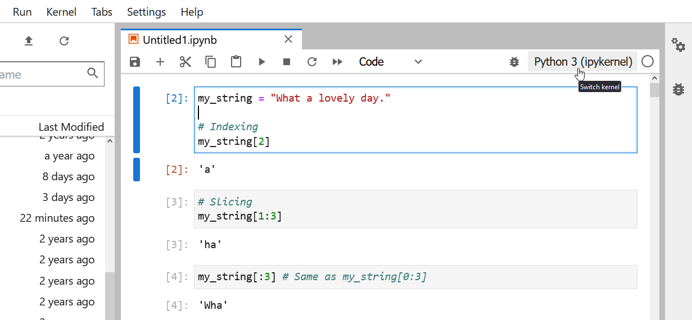

:::::::::::::::::::::::::::::::::::::: questions 

- How do I manage different sets of packages?
- How do I install new packages?

::::::::::::::::::::::::::::::::::::::::::::::::

::::::::::::::::::::::::::::::::::::: objectives

- Understand how Conda environments can improve your research workflow.
- Create a new environment.
- Activate (deactivate) a particular environment.
- Install packages into existing environments using Conda (+pip).
- Specify the installation location of an environment.
- List all of the existing environments on your machine.
- List all of the installed packages within a particular environment.
- Delete an entire environment.

::::::::::::::::::::::::::::::::::::::::::::::::

::::::::::::::::::::::::::::::::::::: keypoints

- A Conda environment is a directory that contains a specific collection of Conda packages that you have installed.
- You create (remove) a new environment using the `conda create` (`conda remove`) commands.
- You activate (deactivate) an environment using the `conda activate` (`conda deactivate`) commands.
- You install packages into environments using `conda install`; you install packages into an active environment using `pip install`.
- You should install each environment as a sub-directory inside its corresponding project directory
- Use the `conda env list` command to list existing environments and their respective locations.
- Use the `conda list` command to list all of the packages installed in an environment.

::::::::::::::::::::::::::::::::::::::::::::::::

## What is a Conda environment

A [Conda environment](https://docs.conda.io/projects/conda/en/latest/user-guide/concepts/environments.html) 
is a directory that contains a specific collection of Conda packages that you have installed. For 
example, you may be working on a research project that requires NumPy 1.18 and its dependencies, 
while another environment associated with an finished project has NumPy 1.12 (perhaps because 
version 1.12 was the most current version of NumPy at the time the project finished). If you 
change one environment, your other environments are not affected. You can easily activate or 
deactivate environments, which is how you switch between them.

::: callout
## Avoid installing packages into your `base` Conda environment

Conda has a default environment called `base` that include a Python installation and some core 
system libraries and dependencies of Conda. It is a "best practice" to avoid installing 
additional packages into your `base` software environment. Additional packages needed for a new 
project should always be installed into a newly created Conda environment.
:::

::: prereq
## Working from the command line

So far, we have been working inside Jupyter Lab. 
However, we now want to manipulate the Python kernels and will be working from outside Jupyter. 

For installing packages and manipulating conda environments, **we will be working from the terminal or Anaconda prompt**. 

### macOS - Command Line
To start the JupyterLab server you will need to access the command line through the Terminal. 
There are two ways to open Terminal on Mac.

1. In your Applications folder, open Utilities and double-click on Terminal
2. Press <kbd>Command</kbd> + <kbd>spacebar</kbd> to launch Spotlight. Type `Terminal` and then 
double-click the search result or hit <kbd>Enter</kbd>

After you have launched Terminal, run `conda init`.

```bash
$ conda init
```

You should now see `(base)` at the start of your terminal line. 

```bash
(base) $ 
```

### Windows Users - Command Line
To start the JupyterLab server you will need to access the Anaconda Prompt.

Press <kbd>Windows Logo Key</kbd> and search for `Anaconda Prompt`, click the result or press enter.

After you have launched Terminal, run `conda init`.

```bash
$ conda init
```

You should now see `(base)` at the start of your terminal line. 

```bash
(base)
```

:::


## Creating environments

To create a new environment for Python development using `conda` you can use the `conda create` 
command.

```bash
$ conda create --name python3-env python
```

For a list of all commands, take a look at [Conda general commands](https://docs.conda.io/projects/conda/en/latest/commands.html).

It is a good idea to give your environment a meaningful name in order to help yourself remember 
the purpose of the environment. While naming things can be difficult, `$PROJECT_NAME-env` is a 
good convention to follow. Sometimes also the specific version of a package why you had to create a new environment is a good name

The command above will create a new Conda environment called "python3" and install the most recent 
version of Python. If you wish, you can specify a particular version of packages for `conda` to 
install when creating the environment.

```bash
$ conda create --name python36-env python=3.6
```

::: callout
## Always specify a version number for each package you wish to install

In order to make your results more reproducible and to make it easier for research colleagues to 
recreate your Conda environments on their machines it is a "best practice" to always explicitly 
specify the version number for each package that you install into an environment. If you are not 
sure exactly which version of a package you want to use, then you can use search to see what 
versions are available using the `conda search` command.

```bash
$ conda search $PACKAGE_NAME
```

So, for example, if you wanted to see which versions of 
[Scikit-learn](https://scikit-learn.org/stable/), a popular Python library for machine learning,
were available, you would run the following. 

```bash
$ conda search scikit-learn
```

As always you can run `conda search --help` to learn about available options.
:::

You can create a Conda environment and install multiple packages by listing the packages 
that you wish to install.

```bash
$ conda create --name basic-scipy-env ipython=7.13 matplotlib=3.1 numpy=1.18 scipy=1.4
```
 
When `conda` installs a package into an environment it also installs any required dependencies. 
For example, even though Python is not listed as a packaged to install into the 
`basic-scipy-env` environment above, `conda` will still install Python into the environment 
because it is a required dependency of at least one of the listed packages.

::: challenge
## Creating a new environment

Create a new environment called "machine-learning-env" with Python and the most current versions 
of [IPython](https://ipython.org/), [Matplotlib](https://matplotlib.org/), 
[Pandas](https://pandas.pydata.org/), [Numba](https://numba.pydata.org/) and 
[Scikit-Learn](https://scikit-learn.org/stable/index.html).

::: solution

In order to create a new environment you use the `conda create` command as follows.

```bash
$ conda create --name machine-learning-env \
 ipython \
 matplotlib \
 pandas \
 python \
 scikit-learn \
 numba
```


Since no version numbers are provided for any of the Python packages, Conda will download the 
most current, mutually compatible versions of the requested packages. However, since it is best 
practice to always provide explicit version numbers, you should prefer the following solution.

```bash
$ conda create --name machine-learning-env \
 ipython=7.19 \
 matplotlib=3.3 \
 pandas=1.2 \
 python=3.8 \
 scikit-learn=0.23 \
 numba=0.51
```


However, please be aware that the version numbers for each packages may not be the latest available and would need to be adjusted.

:::
:::

## Activating an existing environment

Activating environments is essential to making the software in environments work well (or 
sometimes at all!). Activation of an environment does two things.

1. Adds entries to `PATH` for the environment.
2. Runs any activation scripts that the environment may contain.

Step 2 is particularly important as activation scripts are how packages can set arbitrary 
environment variables that may be necessary for their operation. You can activate the 
`basic-scipy-env` environment by name using the `activate` command.

```bash
$ conda activate basic-scipy-env
```

You can see that an environment has been activated because the shell prompt will now include the 
name of the active environment.

```bash
(basic-scipy-env) $
```

## Deactivate the current environment

To deactivate the currently active environment use the Conda `deactivate` command as follows.

```bash
(basic-scipy-env) $ conda deactivate
```


You can see that an environment has been deactivated because the shell prompt will no longer 
include the name of the previously active environment.

```bash
$
```

::: callout
## Returning to the `base` environment

To return to the `base` Conda environment, it's better to call `conda activate` with no 
environment specified, rather than to use `deactivate`. If you run `conda deactivate` from your 
`base` environment, you may lose the ability to run `conda` commands at all. **Don't worry if 
you encounter this undesirable state! Just start a new shell.**
:::

::: challenge
## Activate an existing environment by name

Activate the `machine-learning-env` environment created in the previous challenge by name.

::: solution

In order to activate an existing environment by name you use the `conda activate` command as 
follows.

```bash
$ conda activate machine-learning-env
```
:::
:::

::: challenge
## Deactivate the active environment

Deactivate the `machine-learning-env` environment that you activated in the previous challenge.

::: solution

In order to deactivate the active environment you use the `conda deactivate` command.

```bash
(active-environment-name) $ conda deactivate
```
:::
:::

## Installing a package into an existing environment

You can install a package into an existing environment using the `conda install` command. This 
command accepts a list of package specifications (i.e., `numpy=1.18`) and installs a set of 
packages consistent with those specifications *and* compatible with the underlying environment. If 
full compatibility cannot be assured, an error is reported and the environment is *not* changed.

By default the `conda install` command will install packages into the current, active environment. 
The following would activate the `basic-scipy-env` we created above and install 
[Numba](https://numba.pydata.org/), an open source JIT compiler that translates a subset of Python 
and NumPy code into fast machine code, into the active environment.

```bash
$ conda activate basic-scipy-env
$ conda install numba
```

As was the case when listing packages to install when using the `conda create` command, if version 
numbers are not explicitly provided, Conda will attempt to install the newest versions of any 
requested packages. To accomplish this, Conda may need to update some packages that are already 
installed or install additional packages. It is always a good idea to explicitly provide version 
numbers when installing packages with the `conda install` command. For example, the following would 
install a particular version of Scikit-Learn, into the current, active environment. 

```bash
$ conda install scikit-learn=0.22
```

::: checklist
## Using your environment in Jupyter

We need to perform a few extra steps to make our conda environments available in Jupyter Lab. 

First, we're going to break convention and install the `nb_conda_kernels` into our base environment.

```bash
$ conda activate
$ conda install nb_conda_kernels
```

Now for any environment we want to be available in Jupyter Lab we simply install the `ipykernel` package.

```bash
$ conda activate basic-scipy-env
$ conda install ipykernel
```

We then want to go back to our base environment and start Jupyter Lab:

```bash
$ conda activate
$ jupyter lab
```

Now, when we launch Jupyter Lab our environments should be available as **kernels**. 
You can change your kernel in the top-right of the screen:



And you should see your conda environments available:


::: 


::: callout
## Freezing installed packages

To prevent existing packages from being updating when using the `conda install` command, you can 
use the `--freeze-installed` option. This may force Conda to install older versions of the 
requested packages in order to maintain compatibility with previously installed packages. Using 
the `--freeze-installed` option does not prevent additional dependency packages from being 
installed.
:::

## Where do Conda environments live?

Environments created with `conda`, by default, live in the `envs/` folder of your `miniconda3` (or `anaconda3`) directory the absolute path to which will look something the following: `/Users/$USERNAME/miniconda3/envs` or `C:\Users\$USERNAME\Anaconda3`.

Running `ls` (linux) / `dir` (Windows) on your anaconda `envs/` directory will list out the directories containing the existing Conda environments.

## How do I specify a location for a Conda environment?

You can control where a Conda environment lives by providing a path to a target directory when 
creating the environment. For example to following command will create  a new environment in a 
sub-directory of the current working directory called `env`.

```bash
$ conda create --prefix ./env ipython=7.13 matplotlib=3.1 pandas=1.0 python=3.6
```

You activate an environment created with a prefix using the same command used to activate 
environments created by name.

```bash
$ conda activate ./env
```

It is often a good idea to specify a path to a sub-directory of your project directory when 
creating an environment. Why?

1.  Makes it easy to tell if your project utilizes an isolated environment by including the 
    environment as a sub-directory.
2.  Makes your project more self-contained as everything *including the required software* is 
    contained in a single project directory.

An additional benefit of creating your project's environment inside a sub-directory is that you 
can then use the same name for all your environments; if you keep all of your environments in 
your `~/miniconda3/env/` folder, you’ll have to give each of them a different name.

## Listing existing environments

Now that you have created a number of Conda environments on your local machine you have probably 
forgotten the names of all of the environments and exactly where they live. Fortunately, there is 
a `conda` command to list all of your existing environments together with their locations.

```bash
$ conda env list
```

## Listing the contents of an environment

In addition to forgetting names and locations of Conda environments, at some point you will 
probably forget exactly what has been installed in a particular Conda environment. Again, there is 
a `conda` command for listing the contents on an environment. To list the contents of the 
`basic-scipy-env` that you created above, run the following command.

```bash
$ conda list --name basic-scipy-env
```

If you created your Conda environment using the `--prefix` option to install packages into a 
particular directory, then you will need to use that prefix in order for `conda` to locate the 
environment on your machine.

```bash
$ conda list --prefix /path/to/conda-env
```

::: challenge
## Listing the contents of a particular environment.

List the packages installed in the `machine-learning-env` environment that you created in a 
previous challenge.

::: solution

You can list the packages and their versions installed in `machine-learning-env` using the 
`conda list` command as follows.

```bash
$ conda list --name machine-learning-env
```

To list the packages and their versions installed in the active environment leave off 
the `--name` or `--prefix` option.

```bash
$ conda list
```
:::
:::

## Deleting entire environments

Occasionally, you will want to delete an entire environment. Perhaps you were experimenting with 
`conda` commands and you created an environment you have no intention of using; perhaps you no 
longer need an existing environment and just want to get rid of cruft on your machine. Whatever 
the reason, the command to delete an environment is the following.

```bash
$ conda remove --name my-first-conda-env --all
```


If you wish to delete and environment that you created with a `--prefix` option, then you will 
need to provide the prefix again when removing the environment.

```bash
$ conda remove --prefix /path/to/conda-env/ --all
```

::: challenge
## Delete an entire environment

Delete the entire "basic-scipy-env" environment.

::: solution

In order to delete an entire environment you use the `conda remove` command as follows.

```bash
$ conda remove --name basic-scipy-env --all --yes
```


This command will remove all packages from the named environment before removing the 
environment itself. The use of the `--yes` flag short-circuits the confirmation prompt (and 
should be used with caution).

:::
:::
